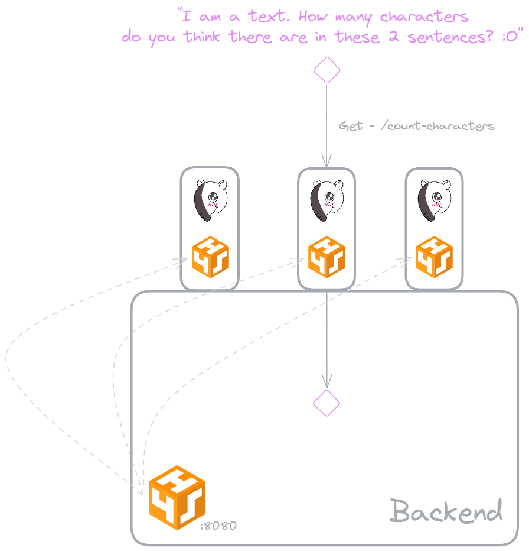
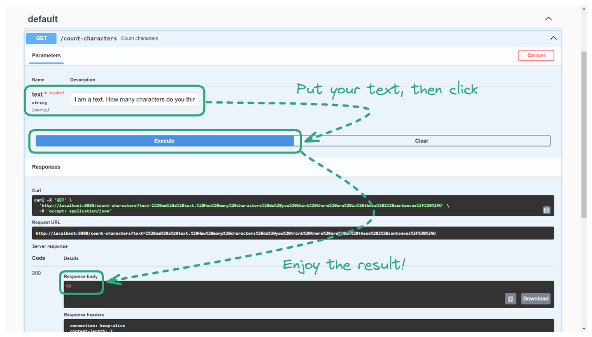
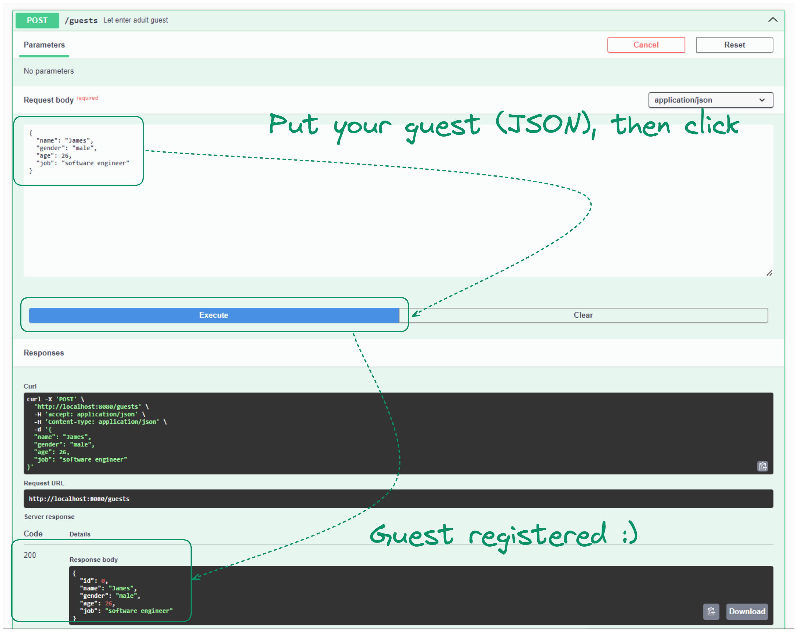
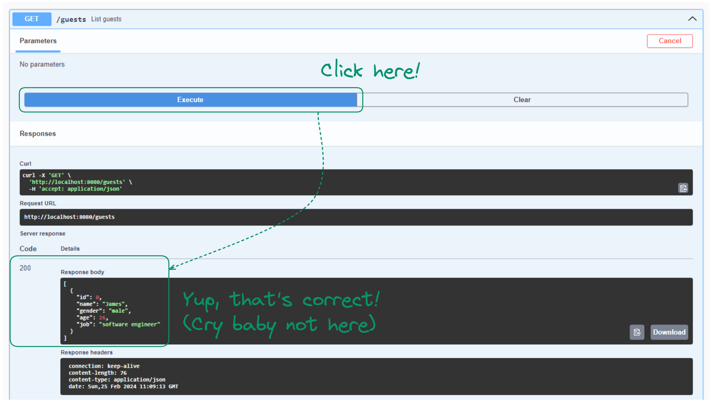
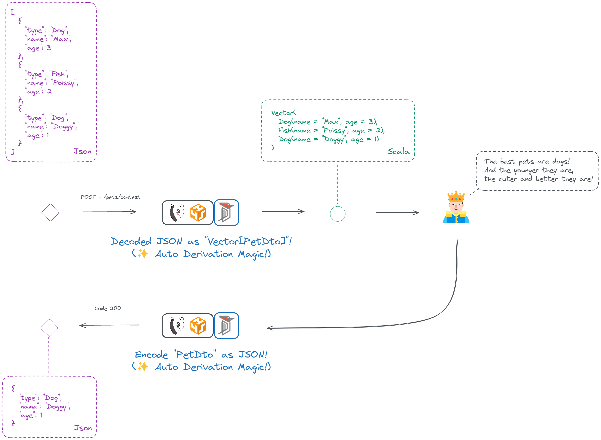
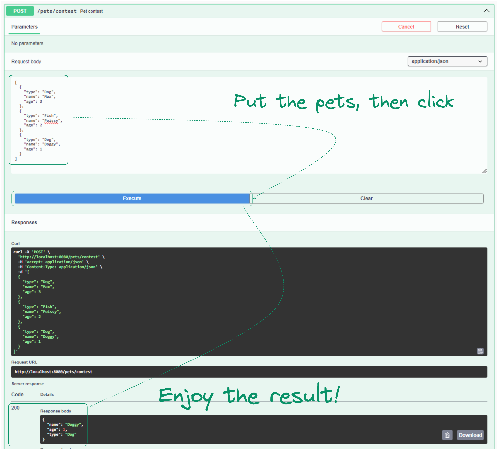

What if I told you there's a game-changing Scala solution for building Rest APIs and generating SwaggerUI docs at lightning speed? Plus, it's as fast as FastAPI (for Python enthusiasts) to develop! All this while preserving the robust type safety and functional programming elegance of Scala! 😲 In this post, we'll dive deep into this exhilarating tech stack: Tapir, http4s, and Circe!

<!-- more -->


## 😎 Why Tapir, http4s, Circe?

Let's check out what is each library:

- Tapir: A powerful Scala library for defining and documenting HTTP APIs in a type-safe and functional manner, with built-in support for generating Swagger UI documentation.
- http4s: A lightweight, purely functional Scala library for building HTTP servers and clients, designed for high performance and composability.
- Circe: A popular JSON library for Scala that provides seamless JSON parsing and encoding using a powerful and idiomatic functional approach.

<figure markdown="span">
  
  <figcaption>Handling Requests</figcaption>
</figure>

As of now, in the Scala ecosystem, there are no actively maintained, production-ready alternatives to Tapir. However, alternatives to http4s include Play and Akka/Pekko Http, with Play being more a full-stack web framework. For JSON handling, alternatives to Circe include json4s, ZIO-json, and Play JSON. According to the [2023 Scala survey](https://scalasurvey2023.virtuslab.com/), it appears that the community is leaning towards the Typelevel ecosystem when it comes to building backend systems. You can also check library comparison websites like [LibHunt](https://scala.libhunt.com/) for further insights.

<figure markdown="span">
  
  <figcaption>Akka/Pekko ecosystem VS Typelevel ecosystem</figcaption>
</figure>

Either way, all these alternatives are production-ready and actively maintained. You cannot go wrong with choosing any of them.

For this series, the complete code is available on GitHub 🫡 at [https://github.com/iLoveDataJjia/blog/tree/main/assets/posts/0/backend](https://github.com/iLoveDataJjia/blog/tree/main/assets/posts/0/backend).

## 🏰 Our Backend Castle!

Setting up a Scala project is essential, and in our case, we'll do it using IntelliJ. However, you can also opt for VSCode with Metals. If it is your first time setting up a Scala project, you can follow Scala's official tutorial ["Getting Started with Scala in IntelliJ"](https://docs.scala-lang.org/getting-started/intellij-track/getting-started-with-scala-in-intellij.html). The folder structure should be as follows:

```
backend/
├── project/
│   ├── build.properties
│   └── plugins.sbt
├── src/
│   └── main/
│       ├── resources/
│       └── scala/
│           └── Main.scala
└── build.sbt
```

In your `build.sbt`, please add the following dependencies:

```scala title="build.sbt" hl_lines="12-18 20-26 28-36 38-46"
/**
 * Project configurations.
 */
ThisBuild / scalaVersion := "2.13.12" // https://www.scala-lang.org/download/all.html
lazy val root = (project in file("."))
  .settings(name := "backend", idePackagePrefix := Some("com.ilovedatajjia"), Defaults.itSettings)
  .configs(IntegrationTest)

/**
 * Dev dependencies.
 */
// Cats & Scala extensions
// https://mvnrepository.com/artifact/org.typelevel/cats-effect
libraryDependencies += "org.typelevel" %% "cats-effect"        % "3.5.3"
// https://github.com/oleg-py/better-monadic-for (look tags for version)
addCompilerPlugin("com.olegpy"         %% "better-monadic-for" % "0.3.1")
// https://mvnrepository.com/artifact/dev.optics/monocle-core
libraryDependencies += "dev.optics"    %% "monocle-core"       % "3.2.0"

// Tapir
// https://mvnrepository.com/artifact/com.softwaremill.sttp.tapir/tapir-http4s-server
libraryDependencies += "com.softwaremill.sttp.tapir" %% "tapir-http4s-server"     % "1.9.10"
// https://mvnrepository.com/artifact/com.softwaremill.sttp.tapir/tapir-json-circe
libraryDependencies += "com.softwaremill.sttp.tapir" %% "tapir-json-circe"        % "1.9.10"
// https://mvnrepository.com/artifact/com.softwaremill.sttp.tapir/tapir-swagger-ui-bundle
libraryDependencies += "com.softwaremill.sttp.tapir" %% "tapir-swagger-ui-bundle" % "1.9.10"

// Http4s
// https://mvnrepository.com/artifact/org.http4s/http4s-ember-server
libraryDependencies += "org.http4s" %% "http4s-ember-server" % "0.23.25"
// https://mvnrepository.com/artifact/org.http4s/http4s-circe
libraryDependencies += "org.http4s" %% "http4s-circe"        % "0.23.25"
// https://mvnrepository.com/artifact/org.http4s/http4s-dsl
libraryDependencies += "org.http4s" %% "http4s-dsl"          % "0.23.25"
// https://mvnrepository.com/artifact/org.http4s/http4s-ember-client
libraryDependencies += "org.http4s" %% "http4s-ember-client" % "0.23.25"

// Circe
// https://mvnrepository.com/artifact/io.circe/circe-parser
libraryDependencies += "io.circe" %% "circe-parser"         % "0.14.6"
// https://mvnrepository.com/artifact/io.circe/circe-generic
libraryDependencies += "io.circe" %% "circe-generic"        % "0.14.6"
// https://mvnrepository.com/artifact/io.circe/circe-generic-extras
libraryDependencies += "io.circe" %% "circe-generic-extras" % "0.14.3"
// https://mvnrepository.com/artifact/io.circe/circe-literal
libraryDependencies += "io.circe" %% "circe-literal"        % "0.14.6"
```

You can run `Main.scala` by clicking on `▷` and selecting `Run 'Main'`. If it works, you are all set! 🥳

### ⚡ Backend Electricity Setup

Let's build our first electric central that will empower the future bridges. A REST API server enables clients to interact with resources over HTTP using standard methods.

<figure markdown="span">
  
  <figcaption>Backend Server Configuration</figcaption>
</figure>

First setup our service which loads environment variables and our backend exceptions:

```scala title="EnvLoaderConf.scala"
package com.ilovedatajjia
package config

object EnvLoaderConf {
  private val allEnvVar: Map[String, String] = sys.env

  val backendPort: Int = allEnvVar.getOrElse("BACKEND_PORT", default = "8080").toInt
}
```

```scala title="BackendException.scala"
package com.ilovedatajjia
package shared

sealed trait BackendException extends Exception

object BackendException {
  case class BadRequestException(message: String)          extends BackendException
  case class ServerInternalErrorException(message: String) extends BackendException
}
```

Second setup our backend server:

```scala title="BackendServerConf.scala"
package com.ilovedatajjia
package config

import cats.effect.IO
import com.comcast.ip4s._
import org.http4s.ember.server.EmberServerBuilder
import org.http4s.server.middleware.CORS
import shared.BackendException.ServerInternalErrorException

object BackendServerConf {
  def start: IO[Unit] = for {
    port <- IO.fromOption(Port.fromInt(envLoaderConf.backendPort))(
              ServerInternalErrorException(s"Not processable port number ${envLoaderConf.backendPort}."))
    _    <- EmberServerBuilder
              .default[IO]
              .withHost(ipv4"0.0.0.0") // Accept connections from any available network interface
              .withPort(port)          // On port 8080
              .build
              .use(_ => IO.never)
              .start
              .void
  } yield ()
}
```

Let's finally build the switch to turn on the electricity! 💡

```scala title="Main.scala"
package com.ilovedatajjia

import cats.effect._
import config.BackendServerConf

object Main extends IOApp.Simple {
  override def run: IO[Unit] = BackendServerConf.start >> IO.never // == non-terminating
}
```

If you visit [http://localhost:8080](http://localhost:8080) and see the message `Not found`, then congratulations! You've built your electric central! 🥳

### 🌉 First Bridge Endpoint!

It's now the exciting part because we are gonna connect to the external world with bridges! 🤩 Endpoints are the specific URLs or routes in a web API that clients use to access and interact with resources or services.

<figure markdown="span">
  
  <figcaption>Backend Endpoint</figcaption>
</figure>

First, implement the business logic, which in our case involves counting the number of characters from a text.

```scala title="TextSvc.scala"
package com.ilovedatajjia
package features.text

import cats.effect.IO
import cats.implicits._

object TextSvc {
  def countCharacters(text: String): IO[Int] = text.length.pure[IO]
}
```

Second, build the bridge! 🌉⚒️

```scala title="TextCtrl.scala"
package com.ilovedatajjia
package features.text

import cats.effect.IO
import org.http4s.HttpRoutes
import sttp.tapir._
import sttp.tapir.json.circe._
import sttp.tapir.server.http4s.Http4sServerInterpreter

object TextCtrl {
  def endpoints: List[AnyEndpoint] = List(countCharactersEpt)
  def routes: HttpRoutes[IO]       = countCharactersRts

  private val countCharactersEpt = endpoint // The endpoint and it is used to generate the OpenAPI doc
    .summary("Count characters")
    .get
    .in("count-characters" / query[String]("text"))
    .out(jsonBody[Int])
  private val countCharactersRts =          // It converts the endpoint to actual http4s route :O
    Http4sServerInterpreter[IO]().toRoutes(countCharactersEpt.serverLogicSuccess(text => TextSvc.countCharacters(text)))
}
```

Lastly, connect our new, fresh 🌉 bridge to our electrical central ⚡️—you know, the one we built in the previous part. 🤗

```scala title="BackendServerConf.scala" hl_lines="22 29-32"
package com.ilovedatajjia
package config

import cats.effect.IO
import cats.implicits._
import com.comcast.ip4s._
import features.text.TextCtrl
import org.http4s.ember.server.EmberServerBuilder
import org.http4s.implicits._
import shared.BackendException.ServerInternalErrorException
import sttp.tapir.server.http4s.Http4sServerInterpreter
import sttp.tapir.swagger.bundle.SwaggerInterpreter

object BackendServerConf {
  def start: IO[Unit] = for {
    port <- IO.fromOption(Port.fromInt(EnvLoaderConf.backendPort))(
              ServerInternalErrorException(s"Not processable port number ${EnvLoaderConf.backendPort}."))
    _    <- EmberServerBuilder
              .default[IO]
              .withHost(ipv4"0.0.0.0")        // Accept connections from any available network interface
              .withPort(port)                 // On port 8080
              .withHttpApp(allRts.orNotFound) // Link all routes to the backend server
              .build
              .use(_ => IO.never)
              .start
              .void
  } yield ()

  private val docsEpt = // Merge all endpoints as a fully usable OpenAPI doc
    SwaggerInterpreter().fromEndpoints[IO](TextCtrl.endpoints, "Backend", "1.0")
  private val allRts  = // Serve the OpenAPI doc & all the other routes
    Http4sServerInterpreter[IO]().toRoutes(docsEpt) <+> TextCtrl.routes
}
```

If you visit [http://localhost:8080/docs](http://localhost:8080/docs) and end up on a SwaggerUI page, then congratulations! You've built your first bridge! 🥳 You can play a little bit with your endpoint! 😄

<figure markdown="span">
  
  <figcaption>SwaggerUI</figcaption>
</figure>

## 🎨 Mastering Circe & Tapir

[JSON](https://en.wikipedia.org/wiki/JSON) is the go-to format when it comes to friendly chats between clients and servers. For example, imagine a frontend [Single Page Application (SPA)](https://en.wikipedia.org/wiki/Single-page_application) running on a user's laptop communicating with a backend [RestAPI](https://en.wikipedia.org/wiki/REST). In this article, let's dive into the joy of decoding JSON data from the outside world into Scala classes, or encoding Scala classes into JSON to share with the world. 🌐✨

<figure markdown="span">
  
  <figcaption>Handling Requests</figcaption>
</figure>

### ✨ Auto Derivation Magic!

#### Theory

"✨ Auto Derivation Magic!" is the technique used to effortlessly convert JSON to Scala case classes or vice versa, leveraging the **attributes of the case classes as JSON fields**. For instance, consider the following JSON object:

```json hl_lines="2-6"
{
  "id": 1,
  "name": "James",
  "gender": "male",
  "age": 26,
  "job": "software engineer"
}
```

The corresponding Scala case class, utilizing auto-derivation, would look like:

```scala hl_lines="4-8"
import features.guest.GuestMod.GenderEnum.Gender

case class GuestMod(
    id: Long,
    name: String,
    gender: Gender,
    age: Int,
    job: String
)

object GuestMod {
  object GenderEnum extends Enumeration {
    type Gender = Value
    val Male: Value      = Value("male")
    val Female: Value    = Value("female")
    val NonBinary: Value = Value("non-binary")
  }
}
```

As you can see, it's all about leveraging **"the case class attributes as JSON fields"**. Importantly, to enable auto-derivation, you'll need to have **an instance object of `io.circe.generic.AutoDerivation` and `sttp.tapir.generic.auto.SchemaDerivation` imported into scope**. But don't worry, we'll delve into this in the practical part.

#### Practice

<figure markdown="span">
  
  <figcaption>✨ Auto derivation in action!</figcaption>
</figure>

First, let's define the classes and methods required:

```scala title="GuestMod.scala"
package com.ilovedatajjia
package features.guest

import features.guest.GuestMod.GenderEnum.Gender
import features.guest.dto.GuestDto

case class GuestMod( // Returned by the endpoints == "Scala -> JSON" (also corresponds to an entity in table)
    id: Long,
    name: String,
    gender: Gender,  // A non Scala simple type that needs to be derived manually! (JSON <-> Scala)
    age: Int,
    job: String)

object GuestMod {
  def buildFromDto(id: Long, dto: GuestDto): GuestMod = GuestMod(id, dto.name, dto.gender, dto.age, dto.job)

  object GenderEnum extends Enumeration {
    type Gender = Value
    val Male: Value      = Value("male")
    val Female: Value    = Value("female")
    val NonBinary: Value = Value("non-binary")
  }
}
```

```scala title="GuestDto.scala"
package com.ilovedatajjia
package features.guest.dto

import features.guest.GuestMod.GenderEnum.Gender

case class GuestDto( // It corresponds to the input of the endpoint (JSON -> Scala)
    name: String,
    gender: Gender,
    age: Int,
    job: String)
```

Secondly, the shortest but most crucial step! ⚠️ **By importing this `Serializers` object into scope, it implies that all case classes will be convertible between "JSON ↔ Scala". 🤯**

```scala title="Serializers.scala" hl_lines="7 9 11"
package com.ilovedatajjia
package features.shared

import features.guest.GuestMod.GenderEnum
import features.guest.GuestMod.GenderEnum.Gender
import io.circe._
import io.circe.generic.AutoDerivation
import sttp.tapir.Schema
import sttp.tapir.generic.auto.SchemaDerivation

object Serializers extends AutoDerivation with SchemaDerivation { // HERE! ✨ Auto Derivation Magic!
  // Enumeration needs to be auto derived manually with theses 3 lines 👇 (It will use enumeration actual values when (en/de)coding)
  implicit val genderEnc: Encoder[Gender] = Encoder.encodeEnumeration(GenderEnum)
  implicit val genderDec: Decoder[Gender] = Decoder.decodeEnumeration(GenderEnum)
  implicit val genderSch: Schema[Gender]  = Schema.derivedEnumerationValue[Gender]
}
```

Thirdly, let's address the repository responsible for managing the `GuestMod` table and the associated business logic:

```scala title="GuestRep.scala"
package com.ilovedatajjia
package features.guest

import cats.effect._
import cats.effect.unsafe.implicits._
import features.guest.dto.GuestDto

object GuestRep { // This layer is not important. It's an in-memory table for the example to work.
  def insert(dto: GuestDto): IO[GuestMod] = guestsTable.modify { table =>
    val id    = table.length
    val guest = GuestMod.buildFromDto(id, dto)
    (table :+ guest, guest) // (Updated table, Returned class)
  }

  def list(): IO[Vector[GuestMod]] = guestsTable.get

  private val guestsTable: Ref[IO, Vector[GuestMod]] =
    Ref[IO].of(Vector.empty[GuestMod]).unsafeRunSync() // A concurrent safe in memory table
}
```

```scala title="GuestSvc.scala" hl_lines="10-12"
package com.ilovedatajjia
package features.guest

import cats.effect.IO
import features.guest.dto.GuestDto
import shared.BackendException.BadRequestException

object GuestSvc {
  def letEnterAdultGuest(dto: GuestDto): IO[GuestMod] = for {
    _     <- IO.raiseUnless(dto.age >= 18)(
               BadRequestException("You are not an adult!") // Exception of "BadRequestException" raised
             )
    guest <- GuestRep.insert(dto)
  } yield guest

  def listGuests(): IO[Vector[GuestMod]] = GuestRep.list()
}
```

Fourth, let's define our 🌉 bridges (endpoints) that will allow guests to enter the castle 🏰 and monitor their activities ("see ya, personal privacy" 👀😈).

```scala title="GuestCtrl.scala" hl_lines="7 23-25 27 41"
package com.ilovedatajjia
package features.guest

import cats.effect.IO
import cats.implicits._
import features.guest.dto.GuestDto
import features.shared.Serializers._ // ✨ Auto Derivation Magic imported in scope! (== Make Scala case classes "JSON ↔ Scala" convertible)
import org.http4s.HttpRoutes
import shared.BackendException.BadRequestException
import sttp.model.StatusCode
import sttp.tapir._
import sttp.tapir.json.circe._
import sttp.tapir.server.http4s.Http4sServerInterpreter

object GuestCtrl {
  def endpoints: List[AnyEndpoint] = List(letEnterAdultGuestEpt, listGuestsEpt)
  def routes: HttpRoutes[IO]       = letEnterAdultGuestRts <+> listGuestsRts

  private val letEnterAdultGuestEpt = endpoint
    .summary("Let enter adult guest")
    .post
    .in("guests")
    .in(jsonBody[GuestDto])                 // ✨ Auto Derivation Magic applied! (Not just simple type but case class this time)
    .out(jsonBody[GuestMod])                // ✨ Auto Derivation Magic applied!
    .errorOut(
      statusCode(StatusCode.BadRequest)
        .and(jsonBody[BadRequestException]) // This endpoint can throw errors + ✨ Auto Derivation Magic applied!
    )
  private val letEnterAdultGuestRts = Http4sServerInterpreter[IO]().toRoutes(
    letEnterAdultGuestEpt
      .serverLogicRecoverErrors( // == recover from "BadRequestException" exceptions raised + Encode as JSON and return them
        dto => GuestSvc.letEnterAdultGuest(dto)))

  private val listGuestsEpt = endpoint
    .summary("List guests")
    .get
    .in("guests")
    .out(
      jsonBody[
        Vector[
          GuestMod // /!\ Vector of Scala case class derivable is also derivable == ✨ Auto Derivation Magic applied!
        ]
      ]
    )
  private val listGuestsRts =
    Http4sServerInterpreter[IO]().toRoutes(listGuestsEpt.serverLogicSuccess(_ => GuestSvc.listGuests()))
}
```

Finally, as done in the previous section, let's "connect the bridges to the electrical central 🌉 ↔ ⚡".

```scala title="BackendServerConf.scala" hl_lines="7 31 33"
package com.ilovedatajjia
package config

import cats.effect.IO
import cats.implicits._
import com.comcast.ip4s._
import features.guest.GuestCtrl
import features.text.TextCtrl
import org.http4s.ember.server.EmberServerBuilder
import org.http4s.implicits._
import shared.BackendException.ServerInternalErrorException
import sttp.tapir.server.http4s.Http4sServerInterpreter
import sttp.tapir.swagger.bundle.SwaggerInterpreter

object BackendServerConf {
  def start: IO[Unit] = for {
    port <- IO.fromOption(Port.fromInt(EnvLoaderConf.backendPort))(
              ServerInternalErrorException(s"Not processable port number ${EnvLoaderConf.backendPort}."))
    _    <- EmberServerBuilder
              .default[IO]
              .withHost(ipv4"0.0.0.0")        // Accept connections from any available network interface
              .withPort(port)                 // On port 8080
              .withHttpApp(allRts.orNotFound) // Link all routes to the backend server
              .build
              .use(_ => IO.never)
              .start
              .void
  } yield ()

  private val docsEpt = // Merge all endpoints as a fully usable OpenAPI doc
    SwaggerInterpreter().fromEndpoints[IO](TextCtrl.endpoints ++ GuestCtrl.endpoints, "Backend", "1.0")
  private val allRts  = // Serve the OpenAPI doc & all the other routes
    Http4sServerInterpreter[IO]().toRoutes(docsEpt) <+> TextCtrl.routes <+> GuestCtrl.routes
}
```

#### Results

After re-running, navigate to [http://localhost:8080/docs](http://localhost:8080/docs) to interact with your new endpoints! 😊

<figure markdown="span">
  
  <figcaption>New guest success</figcaption>
</figure>

<figure markdown="span">
  
  <figcaption>New guest failed</figcaption>
</figure>

<figure markdown="span">
  
  <figcaption>List guests</figcaption>
</figure>

### 🧙‍♂️ Crack ADTs!

#### Theory

[Algebraic Data Types (ADTs)](https://en.wikipedia.org/wiki/Algebraic_data_type) are a way of defining data structures by combining simpler types through two main constructs: Sum Types, representing a choice between alternatives, and Product Types, representing a combination of different types.

Blablabla 🤪, remember that it's commonly just a sealed trait, like this for example (refer to comments if you want to understand in detail):

```scala
sealed trait Pet // It's an ADT because "Product types" and "Sum types"
object Pet {
  case class Dog(name: String,
                  age: Int) // 👈 "Product types" because "(String, Int)" == More complex type by combining types
      extends Pet // "Sum types" because "Dog != Cat != Fish != Bird but Dog + Cat + Fish + Bird = Pet" == Distinct types when united define the type
  case class Cat(name: String, age: Int)  extends Pet
  case class Fish(name: String, age: Int) extends Pet
  case class Bird(name: String, age: Int) extends Pet
}
```

Now, what if I tell you there's a way to apply the "✨ Auto Derivation Magic!" to sealed traits using a discriminator field? 🤯 For example, these two can be encoded or decoded from one to another:

```json hl_lines="3 8 13"
[
  {
    "type": "Dog", // ⚠️ Discriminator field
    "name": "Max",
    "age": 3
  },
  {
    "type": "Fish", // ⚠️ Discriminator field
    "name": "Poissy (← RER A 🤪, don't worry if you don't understand, Parisians will! XDD)",
    "age": 2
  },
  {
    "type": "Dog", // ⚠️ Discriminator field
    "name": "Doggy",
    "age": 1
  }
]
```

```scala
val pets: Vector[Pet] = Vector(
  Dog(name = "Max", age = 3),
  Fish(name = "Poissy (← RER A \uD83E\uDD2A, don't worry if you don't understand, Parisians will! XDD)", age = 2),
  Dog(name = "Doggy", age = 1)
)
```

For this to work, only two things needed:

- **An instance object of `io.circe.generic.extras.AutoDerivation` and `sttp.tapir.generic.auto.SchemaDerivation` imported into scope** (⚠️ switch `io.circe.generic.AutoDerivation` to `io.circe.generic.extras.AutoDerivation`)
- Additionally, **two implicit variables of `io.circe.generic.extras.Configuration` and `sttp.tapir.generic.Configuration` imported into scope** (for the discriminator field)

Bear with me 🙏, you will understand in the practice part 👍!

!!! note

    By default, I recommend always opting for the ADT configuration mentioned above. This is because the ADT configuration supports both standalone case classes and case classes with sealed traits, covering our previous use case seamlessly and providing support for ADTs for free.

#### Practice

<figure markdown="span">
  
  <figcaption>ADT decoded and encoded (Pet contest)</figcaption>
</figure>

First, let's define the sealed trait and the necessary business logic:

```scala title="PetDto.scala"
package com.ilovedatajjia
package features.pet.dto

sealed trait PetDto // An ADT

object PetDto {
  case class Dog(name: String, age: Int)  extends PetDto
  case class Cat(name: String, age: Int)  extends PetDto
  case class Fish(name: String, age: Int) extends PetDto
  case class Bird(name: String, age: Int) extends PetDto
}
```

```scala title="PetSvc.scala"
package com.ilovedatajjia
package features.pet

import cats.effect.IO
import features.pet.dto.PetDto
import features.pet.dto.PetDto.Dog
import shared.BackendException.BadRequestException

object PetSvc {
  def petContest(dto: Vector[PetDto]): IO[PetDto] = for {
    _      <- IO.raiseUnless(dto.nonEmpty)(BadRequestException("Where are the pets ?! 😡"))
    pets    = dto.sortWith {
                case (pet0: Dog, pet1: Dog) => pet0.age < pet1.age // Sort before the younger dog
                case (_: Dog, _)            => true                // Sort before the dog
                case _                      => false
              }
    bestPet = pets.head
  } yield bestPet
}
```

Secondly, the most crucial part, but just 3 lines of code! 🤣 **The switch import and the two additional implicits**.

```scala title="Serializers.scala" hl_lines="7 15-16"
package com.ilovedatajjia
package features.shared

import features.guest.GuestMod.GenderEnum
import features.guest.GuestMod.GenderEnum.Gender
import io.circe._
import io.circe.generic.extras.AutoDerivation // ⚠️ Switched!
import io.circe.generic.extras.Configuration
import sttp.tapir.Schema
import sttp.tapir.generic.{Configuration => TapirConfiguration}
import sttp.tapir.generic.auto.SchemaDerivation

object Serializers extends AutoDerivation with SchemaDerivation { // HERE! ✨ Auto Derivation Magic!
  // The 2 implicits 👇
  implicit val encDecConf: Configuration   = Configuration.default.withDiscriminator("type")
  implicit val schConf: TapirConfiguration = TapirConfiguration.default.withDiscriminator("type")

  // Enumeration needs to be auto derived manually with theses 3 lines 👇 (It will use enumeration actual values when (en/de)coding)
  implicit val genderEnc: Encoder[Gender] = Encoder.encodeEnumeration(GenderEnum)
  implicit val genderDec: Decoder[Gender] = Decoder.decodeEnumeration(GenderEnum)
  implicit val genderSch: Schema[Gender]  = Schema.derivedEnumerationValue[Gender]
}
```

Thirdly, let's define our endpoint.

```scala title="PetCtrl.scala" hl_lines="6 22-23"
package com.ilovedatajjia
package features.pet

import cats.effect.IO
import features.pet.dto.PetDto
import features.shared.Serializers._ // ✨ Auto Derivation Magic + 2 implicits imported in scope! (== Make Scala sealed traits "JSON ↔ Scala" convertible)
import org.http4s.HttpRoutes
import shared.BackendException.BadRequestException
import sttp.model.StatusCode
import sttp.tapir._
import sttp.tapir.json.circe._
import sttp.tapir.server.http4s.Http4sServerInterpreter

object PetCtrl {
  def endpoints: List[AnyEndpoint] = List(petContestEpt)
  def routes: HttpRoutes[IO]       = petContestRts

  private val petContestEpt = endpoint
    .summary("Pet contest")
    .post
    .in("pets" / "contest")
    .in(jsonBody[Vector[PetDto]])                                                   // ✨ Auto Derivation Magic applied! (A sealed trait this time :O)
    .out(jsonBody[PetDto])                                                          // ✨ Auto Derivation Magic applied!
    .errorOut(statusCode(StatusCode.BadRequest).and(jsonBody[BadRequestException])) // ✨ Auto Derivation Magic applied!
  private val petContestRts =
    Http4sServerInterpreter[IO]().toRoutes(petContestEpt.serverLogicRecoverErrors(dto => PetSvc.petContest(dto)))
}
```

Finally, you know the tune now, "🌉 ↔ ⚡".

```scala title="BackendServerConf.scala" hl_lines="33 35"
package com.ilovedatajjia
package config

import cats.effect.IO
import cats.implicits._
import com.comcast.ip4s._
import features.guest.GuestCtrl
import features.pet.PetCtrl
import features.text.TextCtrl
import org.http4s.ember.server.EmberServerBuilder
import org.http4s.implicits._
import shared.BackendException.ServerInternalErrorException
import sttp.tapir.server.http4s.Http4sServerInterpreter
import sttp.tapir.swagger.bundle.SwaggerInterpreter

object BackendServerConf {
  def start: IO[Unit] = for {
    port <- IO.fromOption(Port.fromInt(EnvLoaderConf.backendPort))(
              ServerInternalErrorException(s"Not processable port number ${EnvLoaderConf.backendPort}."))
    _    <- EmberServerBuilder
              .default[IO]
              .withHost(ipv4"0.0.0.0")        // Accept connections from any available network interface
              .withPort(port)                 // On port 8080
              .withHttpApp(allRts.orNotFound) // Link all routes to the backend server
              .build
              .use(_ => IO.never)
              .start
              .void
  } yield ()

  private val docsEpt = // Merge all endpoints as a fully usable OpenAPI doc
    SwaggerInterpreter()
      .fromEndpoints[IO](TextCtrl.endpoints ++ GuestCtrl.endpoints ++ PetCtrl.endpoints, "Backend", "1.0")
  private val allRts  = // Serve the OpenAPI doc & all the other routes
    Http4sServerInterpreter[IO]().toRoutes(docsEpt) <+> TextCtrl.routes <+> GuestCtrl.routes <+> PetCtrl.routes
}
```

#### Results

<figure markdown="span">
  
  <figcaption>Pet contest</figcaption>
</figure>

## 🌟 Happy Endings!

If you've made it this far, you should now be able to handle 80% of overall backend requirements 💪, specifically "friendly chat between clients and servers using JSON". I'm counting on you 🙏, and remember 🥺, there are only three concepts to keep in mind:

- ⚡ **Backend server**

```scala
import com.comcast.ip4s._
import org.http4s.ember.server.EmberServerBuilder

EmberServerBuilder
  .default[IO]
  .withHost(ipv4"0.0.0.0")
  .withPort(myPort)
  .withHttpApp(allRts.orNotFound)
  .build
  .use(_ => IO.never)
  .start
  .void
```

- 🌉 **Endpoint and Route**

```scala
import sttp.model.StatusCode
import sttp.tapir._
import sttp.tapir.json.circe._
import sttp.tapir.server.http4s.Http4sServerInterpreter

private val myEpt = endpoint
  .summary("My endpoint summary")
  .post
  .in("my-endpoint-path")
  .in(jsonBody[???])
  .out(jsonBody[???])
  .errorOut(statusCode(StatusCode.???).and(jsonBody[???]))
private val myRts =
  Http4sServerInterpreter[IO]().toRoutes(myEpt.serverLogicRecoverErrors(inputs => ???))
```

- ✨ **Auto Derivation Magic!**

```scala
import io.circe._
import io.circe.generic.extras.AutoDerivation
import io.circe.generic.extras.Configuration
import sttp.tapir.Schema
import sttp.tapir.generic.{Configuration => TapirConfiguration}
import sttp.tapir.generic.auto.SchemaDerivation

object Serializers extends AutoDerivation with SchemaDerivation {
  implicit val encDecConf: Configuration   = Configuration.default.withDiscriminator("type")
  implicit val schConf: TapirConfiguration = TapirConfiguration.default.withDiscriminator("type")

  // ... some other encoders, decoders and schemas that needs to be defined manually (like enums)
}
```

The remaining 20% involves setting up security, streaming support, web sockets, server-sent events, and serving static content. You can find more information about these topics on the [Tapir official docs](https://tapir.softwaremill.com/en/latest/). In most cases, these only need to be set up once or may not be necessary. However, if you'd like me to cover them, please let me know! You can reach me on social media by sending a message 🤗!
