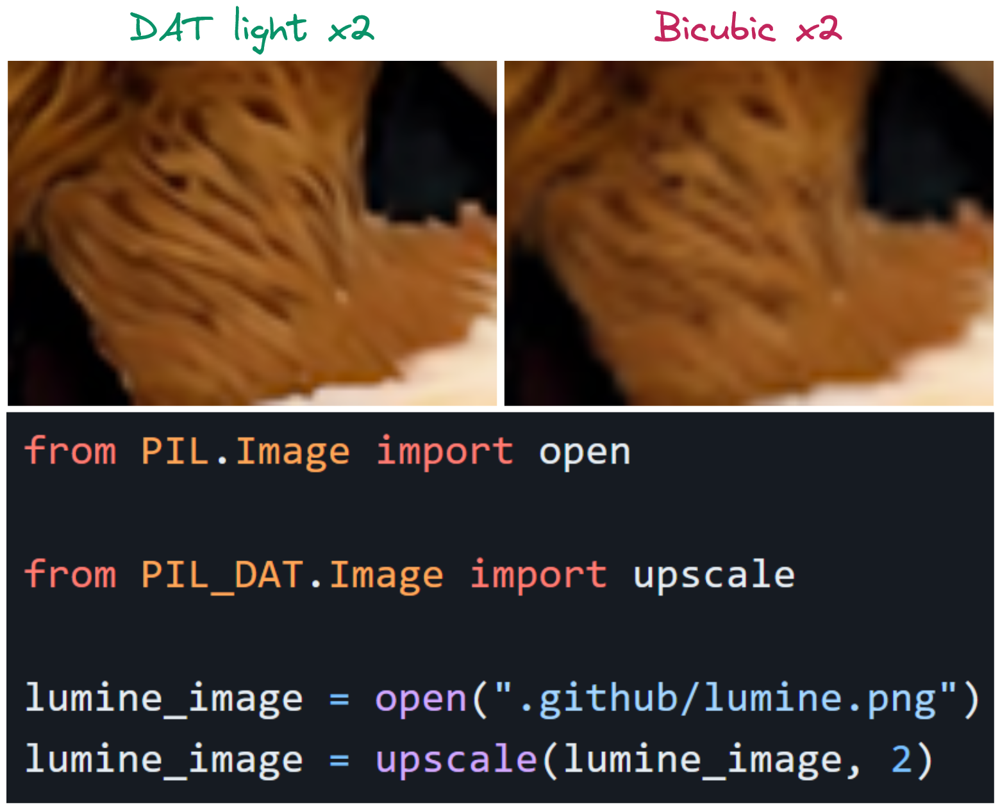
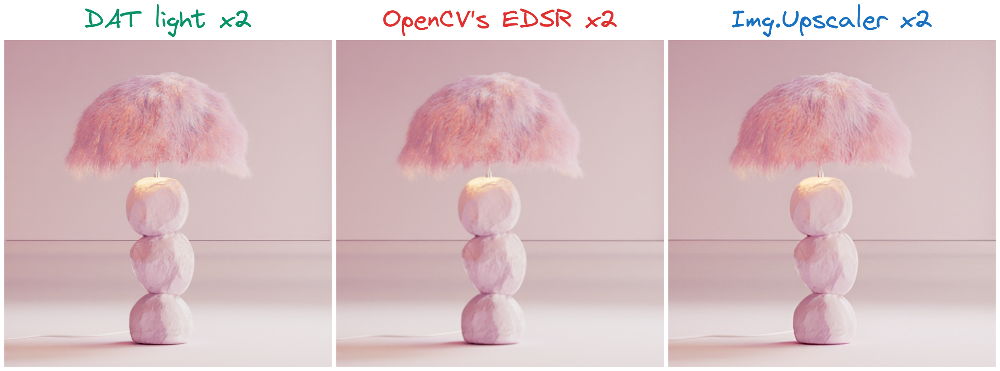
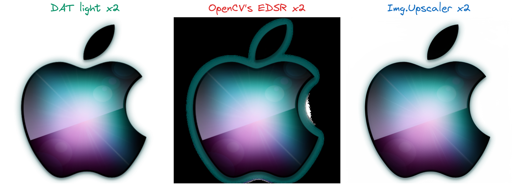

As a Python aficionado, I sought to leverage my programming acumen to enhance cherished images. Armed with the powerful **Pillow** library, I embarked on this mission, only to be met with disappointment 😑 when the results from the conventional `resize` method yielded subpar quality – a far cry from the vibrant images I envisioned. In this article, I am excited to unveil a groundbreaking solution. Say goodbye to lackluster results and hello to superior image quality! 🫨

<!-- more -->



## 🤔 Why DAT?

Image super resolution and bicubic interpolation differ in their methods for improving image quality. Bicubic interpolation is a simple algorithm that adjusts pixel values to resize images, often leading to blurry outcomes when enlarging. Conversely, image super resolution, powered by deep learning models like CNNs, aims to create high-resolution images with enhanced details by learning from high-quality data.

**DAT** stands as one of the foremost image super-resolution algorithms. Presently, accessible and user-friendly open-source alternatives encompass:

- **OpenCV's** models (**EDSR, ESPCN, FSRCNN, LapSRN**) from [`opencv-contrib-python-headless`](https://pypi.org/project/opencv-contrib-python-headless/) library
- **ESRGAN** from [github.com/xinntao/ESRGAN](https://github.com/xinntao/ESRGAN)

These options necessitate an initial setup, like downloading weights. For ESRGAN, some code tinkering is needed to make it programmatically usable. Additionally, these alternatives are becoming dated — **EDSR** was released in 2017 and **ESRGAN** in 2018. The field of research in image super resolution has since progressed.

<figure markdown="span">
  
  <figcaption>Image Super-Resolution on Set14 - 4x upscaling (paperswithcode.com)</figcaption>
</figure>

As machine learning engineers, data scientists, or even Python developers, we always seek the best, newest, most versatile, user-friendly, and fastest models, don't we? So, let's kick things off with [**DAT**](https://pypi.org/project/pillow-dat/)! 😎

## 🚀 How to use DAT?

### Quickstart: `upscale`

For the installation according to your dependency manager:

```bash title="PyPI"
pip install pillow-dat
```

```bash title="Poetry"
poetry add pillow-dat
```

For the usage:

```python title="example.py" hl_lines="6"
from PIL.Image import open

from PIL_DAT.Image import upscale

lumine_image = open(".github/lumine.png")
lumine_image = upscale(lumine_image, 2)
```

As you can see, **DAT** is usable through [`pillow-dat`](https://pypi.org/project/pillow-dat/), a **Pillow** library extension. It provides an upscale of times 2, 3 and 4. But the best of all, it's just one line of code 😎.

### Advanced: **custom models**

The library offers four versions of **DAT** models for advanced programmers. Here's an example for a scaling factor of 4:

- **DAT light** with **573K parameters**
- **DAT S** with **11.21M parameters**
- **DAT 2** with **11.21M parameters**
- **DAT** with **14.80M parameters**

By default, the method `PIL_DAT.Image.upscale` utilizes the embarked **DAT light** models. However, if you're feeling adventurous or require even higher image quality, you can access these advanced versions using **custom models**:

```python title="example_custom_model.py" hl_lines="6-7"
from PIL.Image import open

from PIL_DAT.dat_s import DATS

lumine_image = open(".github/lumine.png")
model = DATS("./dist/DAT_S_x4.pth", 4)  # Instantiate a reusable custom model instance
lumine_image = model.upscale(lumine_image)
lumine_image.show()
```

Please note that model weights in `*.pth` format are accessible via a Google Drive link provided on [GitHub](https://github.com/lovindata/pillow-dat) or [PyPI](https://pypi.org/project/pillow-dat/).

By default, when you use the `PIL_DAT.Image.upscale` method, it loads the model, performs the upscaling, and clears the model from the RAM for you. For better performance, especially when calling this function multiple times for the same scaling factor, it's recommended to instantiate the **DAT light** model via **custom models**.

```python hl_lines="6-7"
from PIL.Image import open

from PIL_DAT.dat_light import DATLight

lumine_image = open(".github/lumine.png")
model = DATLight(2)  # Instantiate a reusable DATLight custom model instance
lumine_image = model.upscale(lumine_image)
lumine_image.show()
```

## 📊 Benchmarks

**DAT** will be compared to **OpenCV's** top super resolution model, **EDSR**, and a commercial SaaS product, [**Img.Upscaler**](https://imgupscaler.com/).

All benchmark results presented here are reproducible. For detailed implementation, please consult the following resources:

- Located in the [benchmarks](https://github.com/lovindata/pillow-dat/tree/main/benchmarks) folder on the official GitHub repository of [`pillow-dat`](https://github.com/lovindata/pillow-dat).
- Within the [scripts](https://github.com/lovindata/blog/tree/main/assets/posts/1/scripts) folder that houses our personal source code, used for testing this library.

### Speed

Performance benchmarks have been conducted on a computing system equipped with an **Intel(R) CORE(TM) i7-9750H CPU @ 2.60GHz processor**, accompanied by a **2 × 8 Go at 2667MHz RAM** configuration. Below are the recorded results:

|  _In seconds_  | 320 × 320 | 640 × 640 | 960 × 960 | 1280 × 1280 |
| :------------: | :-------: | :-------: | :-------: | :---------: |
| DAT light (x2) |   16.1    |   65.3    |   146.8   |    339.8    |
| DAT light (x3) |   14.3    |   61.7    |     -     |      -      |
| DAT light (x4) |   14.0    |   63.0    |     -     |      -      |

The results were compared against the renowned [`OpenCV`](https://opencv.org/) library, utilizing its `EDSR` model known for delivering superior image quality.

| _In seconds_ | 320 × 320 | 640 × 640 | 960 × 960 | 1280 × 1280 |
| :----------: | :-------: | :-------: | :-------: | :---------: |
|  EDSR (x2)   |   25.6    |   112.9   |   264.1   |    472.8    |
|  EDSR (x3)   |   24.3    |   112.5   |     -     |      -      |
|  EDSR (x4)   |   23.6    |   111.2   |     -     |      -      |

_Note:_ Since we don't have control over [**Img.Upscaler's**](https://imgupscaler.com/) hardware specifications, it's challenging to provide accurate speed benchmarks.

### Quality

Let's delineate five key themes encompassing all image types: **Abstract, Animal, Nature, Object, and People**. Subsequently, we will employ each solution to upscale images under each respective theme.

<figure markdown="span">
  
  <figcaption>Abstract</figcaption>
</figure>

<figure markdown="span">
  
  <figcaption>Animal</figcaption>
</figure>

<figure markdown="span">
  
  <figcaption>Nature</figcaption>
</figure>

<figure markdown="span">
  
  <figcaption>Object</figcaption>
</figure>

<figure markdown="span">
  
  <figcaption>People</figcaption>
</figure>

While the images may initially seem identical, closer inspection or zooming in reveals subtle quality differences. Let's examine the zoomed images for a clearer view! 🔎

<figure markdown="span">
  
  <figcaption>Abstract Zoomed</figcaption>
</figure>

<figure markdown="span">
  
  <figcaption>Animal Zoomed</figcaption>
</figure>

<figure markdown="span">
  
  <figcaption>Nature Zoomed</figcaption>
</figure>

<figure markdown="span">
  
  <figcaption>Object Zoomed</figcaption>
</figure>

<figure markdown="span">
  
  <figcaption>People Zoomed</figcaption>
</figure>

While informative, these tests may not encompass every scenario for each solution. Your images may vary, impacting results. For the most reliable assessment, try each solution yourself to form your own opinion! 😉

### Alpha-channel-awareness

State-of-the-art super-resolution models typically only support RGB images, and this holds true for the original **DAT** models as well. The reason behind this is that datasets used for comparing models in research predominantly consist of RGB images. As a user, this can pose a challenge. However, [`pillow-dat`](https://github.com/lovindata/pillow-dat) offers a solution with its **built-in post-processing logic, effortlessly handling any alpha channel** for you! 🌟

<figure markdown="span">
  
  <figcaption>Alpha-channel-awareness</figcaption>
</figure>

In this example, we're just comparing the basic usage of each solution. While it's possible to manage the alpha channel manually for the **OpenCV's EDSR** case, it would require additional effort.

## 👑 Conclusion

This library is founded upon the pioneering research paper, ["Dual Aggregation Transformer for Image Super-Resolution"](https://openaccess.thecvf.com/content/ICCV2023/papers/Chen_Dual_Aggregation_Transformer_for_Image_Super-Resolution_ICCV_2023_paper.pdf).

```
@inproceedings{chen2023dual,
    title={Dual Aggregation Transformer for Image Super-Resolution},
    author={Chen, Zheng and Zhang, Yulun and Gu, Jinjin and Kong, Linghe and Yang, Xiaokang and Yu, Fisher},
    booktitle={ICCV},
    year={2023}
}
```

We extend our heartfelt appreciation to both the researchers and engineers. The researchers' groundbreaking contributions have inspired the development of this library, pushing forward image super-resolution. Moreover, the engineers' efforts have made the model accessible to basic developers, expanding the reach of this technology. 🙏
