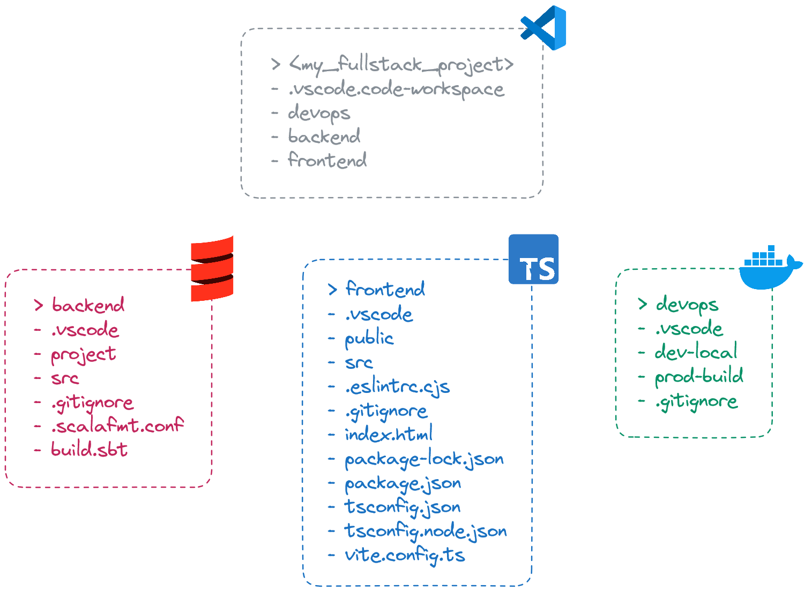
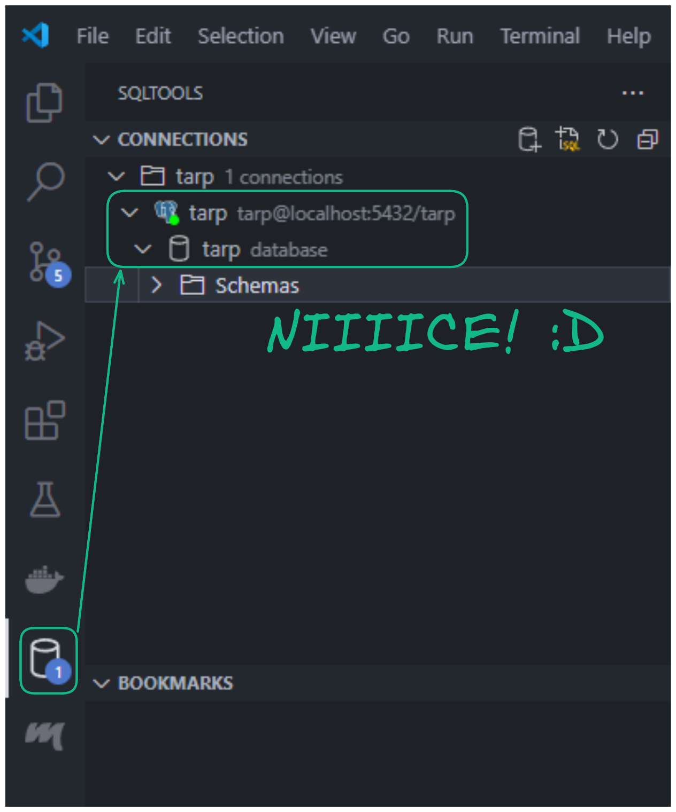

I landed my first job as a Data Engineer using Scala. It's been over 3 years now, approaching 4 years. The more experience you gain, the more you want to spread your wings 🪽 to tackle even bigger and more complex projects than just data pipelines, like developing **full-stack web data applications**. But, I really do not want to dissipate myself too much on all the programming languages, libraries, or frameworks out there 😣. These are just tools. What's important is how efficiently you can use them for the product or feature you envisioned 🦄🌈. Sooo! For me, it's currently the **TARP** tech stack!

<!-- more -->


## 🤔 What is TARP?

**TARP** stands for **Tapir**, **React** and **PostgreSQL**. In detail:

- 🦛 **Tapir**: For the backend, it's a lightweight library similar to FastAPI, designed for building endpoints and providing free SwaggerUI docs.
- ⚛️ **React**: For the frontend, it's the most popular framework with the largest community, according to the [Stack Overflow Developer Survey 2023](https://survey.stackoverflow.co/2023/#section-admired-and-desired-web-frameworks-and-technologies).
- 🐘 **PostgreSQL**: Chosen for the database due to its popularity and strong community support, as indicated by the [Stack Overflow Developer Survey 2023](https://survey.stackoverflow.co/2023/#section-admired-and-desired-web-frameworks-and-technologies).

I'm really excited 😄 to demonstrate how productive you can be with this tech stack. Let's start building, shall we! By the way, do you know what "TARP" stands for? 🤣 A tarp functions as a waterproof protective cover, for example, when building tents ⛺.

## 👨‍💻 Development Environment

For your coding environment, I highly recommend using [VSCode](https://code.visualstudio.com/). It has amazing support for [TypeScript](https://www.typescriptlang.org/) and [Docker](https://www.docker.com/) with various extensions. Scala development can also be done on VSCode using the [Metals](https://scalameta.org/metals/docs/editors/vscode/) extension. I used to develop on IntelliJ, but got tired of switching between VSCode and [IntelliJ](https://www.jetbrains.com/idea/) 😫. So yeah, if you have to handle more than just Scala code, just go with VS Code 😋.

Let's create 3 folders: `./devops`, `./backend`, `./frontend`, and also the `./vscode.code-workspace` file.

```json title="./vscode.code-workspace"
{
  "folders": [
    {
      "path": "backend"
    },
    {
      "path": "devops"
    },
    {
      "path": "frontend"
    }
  ]
}
```

You've just organized your project into [VSCode workspaces](https://code.visualstudio.com/docs/editor/workspaces). This is a way to instruct VSCode to treat each folder as an independent workspace, allowing you to **work on them simultaneously within a single VSCode window**. When you open the `./vscode.code-workspace` file using VSCode, it will automatically detect three workspaces.

<figure markdown="span">
  
  <figcaption>VSCode workspaces</figcaption>
</figure>

At the end of this section, you should have established a well-structured VSCode folder for your FullStack application.

<figure markdown="span">
  
  <figcaption>Folder structure</figcaption>
</figure>

### Database

The goal here is to set up a local PostgreSQL database and be able to explore it with suitable tools. This will be achieved using a [PostgreSQL Docker container](https://hub.docker.com/_/postgres) and the SQLTools VSCode extension. Please install:

- 🐳 [Docker Desktop](https://www.docker.com/products/docker-desktop/): For setting up a local PostgreSQL database.
- ➕ [Docker](https://code.visualstudio.com/docs/containers/overview) VSCode extension: To execute Docker commands directly via the VSCode UI.
- 🔎 [SQLTools](https://marketplace.visualstudio.com/items?itemName=mtxr.sqltools) and [SQLTools PostgreSQL/Cockroach Driver](https://marketplace.visualstudio.com/items?itemName=mtxr.sqltools-driver-pg) VSCode extensions: For viewing the local PostgreSQL database.

Let's create a [Docker Compose](https://docs.docker.com/compose/gettingstarted/) file, which is simply a YAML file with specific syntax, to run the local PostgreSQL database.

```yaml title="./devops/dev-local/docker-compose.yml"
services:
  database:
    image: postgres:16.2
    ports:
      - "5432:5432"
    environment:
      - POSTGRES_PASSWORD=tarp
      - POSTGRES_USER=tarp
      - POSTGRES_DB=tarp
    volumes:
      - ./data:/var/lib/postgresql/data # Optional, but can keep our database data persistent on the host disk.
```

You are now all set to run it:

- Right click on `devops/dev-local/docker-compose.yml`
- Click on `Compose Up`

After a little while, if you go to the Docker Desktop application, you should see your local PostgreSQL database running 😃!

<figure markdown="span">
  
  <figcaption>PostgreSQL container</figcaption>
</figure>

To ensure the local PostgreSQL setup is correct, you can explore it using the SQLTools extension in VSCode. To do this, add a new connection in SQLTools:

- `CTRL + SHIFT + P`
- Click on `SQLTools Management: Add New Connection`
- Follow the instructions and fill in the fields according to how the PostgreSQL container is defined in `devops/dev-local/docker-compose.yml`

<figure markdown="span">
  
  <figcaption>PostgreSQL view using SQLTools</figcaption>
</figure>

If you've reached this point, your local PostgreSQL database is now all set for development! 👍

### Backend

### Frontend

## 🏗️ Building Your Application

### Database

### Backend

### Frontend

## 🎁 Wrapping Up For Production

### Serving React via Tapir

### Optimized Docker Build

## 🌟 Full-Stack Developer Reached!
