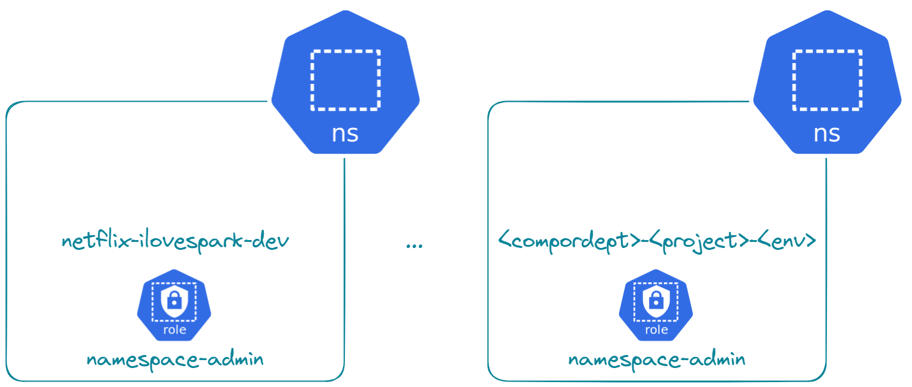

Heyoooo [Spark ⚡](https://spark.apache.org/) developers! My product manager a few months ago asked me one question: "Is it possible to run Spark applications without [K8s 🐳](https://kubernetes.io/) cluster-level access?" At the time, I only knew the [Kubeflow 🔧 Spark Operator](https://github.com/kubeflow/spark-operator) well and was using it for deploying all my Spark applications. For those who know, you must have admin K8s cluster access to use the Kubeflow Spark Operator. The reasons are because it installs [CRDs](https://kubernetes.io/docs/concepts/extend-kubernetes/api-extension/custom-resources/#customresourcedefinitions) and [ClusterRole](https://kubernetes.io/docs/reference/access-authn-authz/rbac/#role-and-clusterrole). So I told him "no" with these reasons, and on his side, he tried his best to convince the prospect with the constraint in mind. At the enterprise level, they usually have a [multi-tenant K8s cluster](https://kubernetes.io/docs/concepts/security/multi-tenancy/) segregated by company/department, project, and environment (dev, uat, pre-prod, or prod) using [Namespaces](https://kubernetes.io/docs/concepts/security/multi-tenancy/#namespaces). This way, they make the most of the computing resources allocated. Plus, if one project does not meet the expectation or the contract ends, hop hop `kubectl delete <compordept>-<project>-<env>` and it's like the project has never existed. I am currently writing to tell my product manager, "Yes, it's possible to run Spark applications without K8s cluster-level access."! Here is how! 🚀

<!-- more -->

## 🤔 K8s, Spark and Kubeflow?

What are **K8s**, **Spark**, and **Kubeflow Spark Operator**? Quickly:

- 🐳 [**K8s**](https://kubernetes.io/): Kubernetes (K8s) is an open-source container orchestration platform designed to automate the deployment, scaling, and management of containerized applications, often used to orchestrate complex frameworks like [Apache Spark](https://spark.apache.org/) for efficient data processing at scale.
- ⚡ [**Spark**](https://spark.apache.org/): Apache Spark is an open-source distributed computing framework that enables fast data processing and analytics, widely recognized and supported by the company [Databricks](https://www.databricks.com/) in big data environments.
- 🔧 [**Kubeflow Spark Operator**](https://github.com/kubeflow/spark-operator): The Kubeflow Spark Operator facilitates seamless integration of Apache Spark with Kubernetes. Originally developed by [Google Cloud Platform](https://cloud.google.com/?hl=en), it has recently been donated to the [Kubeflow community](https://www.kubeflow.org/).

At the end of this guide, you should also be able to launch a Spark application on a Kubernetes cluster and understand when to use basic Spark CLI or the Kubeflow Spark Operator. Let's get started!

## 👨‍💻 Local K8s for development

In this part, we are going to install a one-node K8s locally and simulate an enterprise K8s segregated by namespaces.

<figure markdown="span">
  
  <figcaption>Segregate by namespaces</figcaption>
</figure>

The goal is to set up the prerequisites for when we are going to launch Spark applications.

### Installation

In the past, there was [minikube](https://minikube.sigs.k8s.io/docs/) for local K8s development. But now, [Docker Desktop](https://www.docker.com/products/docker-desktop/) has integrated and Kubernetes directly 🤩! So let's install Docker Desktop.

<figure markdown="span">
  
  <figcaption>Downloading Docker Dekstop</figcaption>
</figure>

Then you just need to launch the executable and follow the instructions. Once you have successfully installed Docker Desktop, then to have you single-node K8s cluster:

- Go to `Settings (top-right) > Kubernetes`
- Check the box `Enable Kubernetes`
- Click on `Apply & restart` > Click on `Install`
- It should starts pulling necessary docker images

After a while, you should have the above screen with the little `Kubernetes running` on the bottom left.

### Isolated namespace

## 💻 Spark on K8s via CLI

### Submitting a Spark job

### Multi-tenant K8s

## 🔧 Spark on K8s via Kubeflow

### Submitting a Spark job

### Multi-tenant K8s

## 🔚 Conclusion

I write monthly on the [LovinData Blog](https://lovindata.github.io/blog/) and on [Medium](https://medium.com/@jamesjg), and like to give back the knowledge I've learned. So don't hesitate to reach out; I'm always available to chat about nerdy stuff 🤗! Here are my socials: [LinkedIn](https://www.linkedin.com/in/james-jiang-87306b155/), [Twitter](https://twitter.com/jamesjg_) and [Reddit](https://www.reddit.com/user/lovindata/). Otherwise, let's learn together in the next story 🫡! Bye ❤️.
