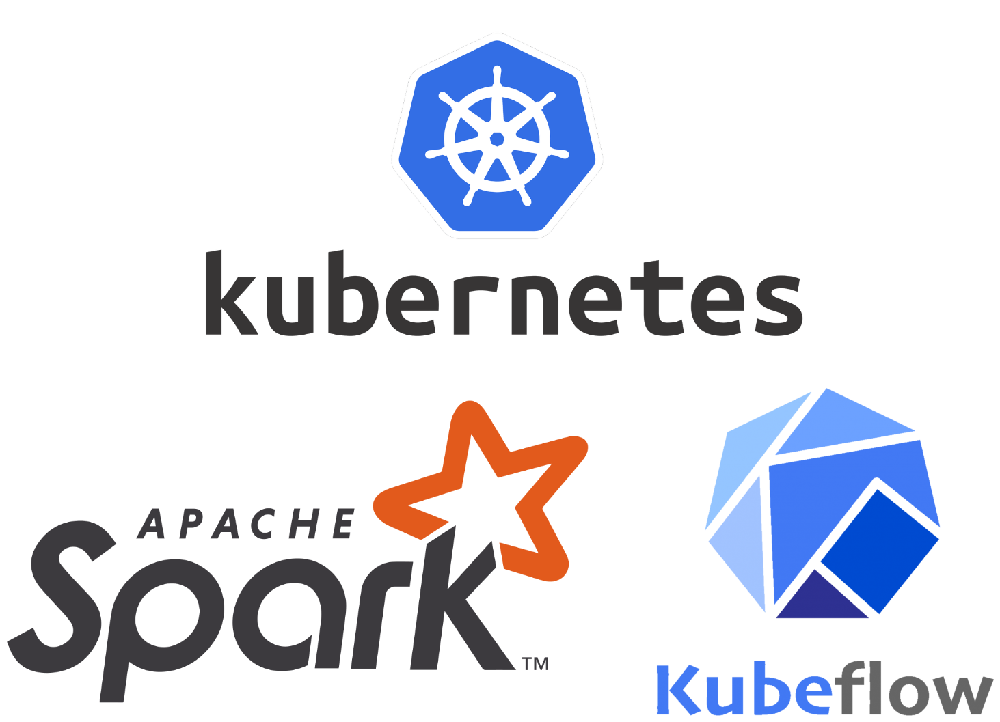
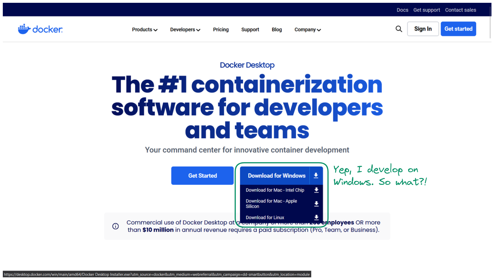

Heyoooo [Spark ⚡](https://spark.apache.org/) developers! My product manager a few months ago asked me one question: "Is it possible to run Spark applications without [K8s 🐳](https://kubernetes.io/) cluster-level access?" At the time, I only knew the [Kubeflow 🔧 Spark Operator](https://github.com/kubeflow/spark-operator) well and was using it for deploying all my Spark applications. For those who know, you must have K8s cluster-level access to use the Kubeflow Spark Operator. The reasons are because it installs [CRDs](https://kubernetes.io/docs/concepts/extend-kubernetes/api-extension/custom-resources/#customresourcedefinitions) and [ClusterRole](https://kubernetes.io/docs/reference/access-authn-authz/rbac/#role-and-clusterrole). So I told him "no" with these reasons, and on his side, he tried his best to convince the prospect with the constraint in mind. At the enterprise level, they usually have a [multi-tenant K8s cluster](https://kubernetes.io/docs/concepts/security/multi-tenancy/) segregated by company/department, project, and environment (dev, uat, pre-prod, or prod) using [Namespaces](https://kubernetes.io/docs/concepts/security/multi-tenancy/#namespaces). This way, they make the most of the computing resources allocated. Plus, if one project does not meet the expectation or the contract ends, hop hop `kubectl delete <compordept>-<project>-<env>` and it's like the project has never existed. I am currently writing to tell my product manager, "Yes, it's possible to run Spark applications without K8s cluster-level access."! Here is how! 🚀

<!-- more -->



## 🤔 K8s, Spark and Kubeflow?

What are **K8s**, **Spark**, and **Kubeflow Spark Operator**? Quickly:

- 🐳 [**K8s**](https://kubernetes.io/): Kubernetes (K8s) is an open-source container orchestration platform designed to automate the deployment, scaling, and management of containerized applications, often used to orchestrate complex frameworks like [Apache Spark](https://spark.apache.org/) for efficient data processing at scale.
- ⚡ [**Spark**](https://spark.apache.org/): Apache Spark is an open-source distributed computing framework that enables fast data processing and analytics, widely recognized and supported by the company [Databricks](https://www.databricks.com/) in big data environments.
- 🔧 [**Kubeflow Spark Operator**](https://github.com/kubeflow/spark-operator): The Kubeflow Spark Operator facilitates seamless integration of Apache Spark with Kubernetes. Originally developed by [Google Cloud Platform](https://cloud.google.com/?hl=en), it has recently been donated to the [Kubeflow community](https://www.kubeflow.org/).

At the end of this guide, you should also be able to launch a Spark application on a Kubernetes cluster and understand when to use basic Spark CLI or the Kubeflow Spark Operator. Let's get started!

## 👨‍💻 Local K8s for development

In this part, we are going to install a one-node K8s locally and simulate an enterprise K8s segregated by namespaces.

<figure markdown="span">
  
  <figcaption>Segregate by namespaces</figcaption>
</figure>

The goal is to set up the prerequisites for when we are going to launch Spark applications.

### Installation

In the past, there was [minikube](https://minikube.sigs.k8s.io/docs/) for local K8s development. But now, [Docker Desktop](https://www.docker.com/products/docker-desktop/) has integrated Kubernetes directly 🤩! So let's install Docker Desktop.

<figure markdown="span">
  
  <figcaption>Downloading Docker Dekstop</figcaption>
</figure>

Then you just need to launch the executable and follow the instructions. Once you have successfully installed Docker Desktop, to have your single-node K8s cluster:

- Go to `Settings (top-right) > Kubernetes`
- Check the box `Enable Kubernetes`
- Click on `Apply & restart` > Click on `Install`
- It should start pulling necessary Docker images

After a while, you should see the screen with the little `Kubernetes running` on the bottom left. You can validate your installation by opening a terminal, then the following command.

```bash
kubectl get nodes
```

It should return an output similar to this:

```bash
NAME             STATUS   ROLES           AGE     VERSION
docker-desktop   Ready    control-plane   6d23h   v1.29.2
```

Nice! 🎉 You've successfully installed Kubernetes.

### Isolated namespace

The goal now is to set up isolated namespaces to simulate an enterprise multi-tenant Kubernetes cluster. To set up an isolated namespace, here are the essentials:

- **A namespace under quota**: Kubernetes resources are not unlimited. The relevant resources to limit are CPU, RAM, ephemeral storage, number of pods, and other resources as necessary.
- **An admin namespace role**: Users must be restricted to a namespace, but within this namespace, Kubernetes admins should provide all necessary access for them to operate autonomously. However, they should not have permission to create, update, or delete quotas and roles.
- **Expirable access**: Projects do not last indefinitely, so access should not be permanent either.

Let's get to work!

First, the **namespace under quota**:

```bash
kubectl create ns compordept-project-env # Create the namespace.
kubectl config set-context docker-desktop --namespace=compordept-project-env # Switch to the namespace.
echo '
---
apiVersion: v1
kind: ResourceQuota
metadata:
  name: namespace-quota
spec:
  hard:
    limits.memory: "1939Mi"
    requests.cpu: "3"
    requests.memory: "1939Mi"
    persistentvolumeclaims: "9"
    requests.ephemeral-storage: "227Gi"
    limits.ephemeral-storage: "227Gi"
    pods: "27"
    services: "9"
' | kubectl apply -f -
```

Second, the **admin namespace role:**

```bash
echo '
# This script lists all namespaced resources and sub-resources except "resourcequotas" and "role". The goal is to have them in a final YAML array which we can pipe to the kubectl command.

import subprocess, json
kubectl_get_raw_as_dict = lambda path: json.loads(subprocess.check_output(f"kubectl get --raw {path}", shell=True, text=True, stderr=subprocess.PIPE))
print_as_yaml_array = lambda list_of_strings: print(json.dumps(list_of_strings))

paths = kubectl_get_raw_as_dict("/")["paths"]
output_resources = []
for path in paths:
  try:
    resources = kubectl_get_raw_as_dict(path)["resources"]
    resources = [resource["name"] for resource in resources if resource["namespaced"] == True and (resource["name"] not in ["resourcequotas", "roles"])]
    output_resources.extend(resources)
  except:
    pass
print_as_yaml_array(output_resources) # Print to the console for piping.
' | python3 | xargs -I {} echo '
---
apiVersion: rbac.authorization.k8s.io/v1
kind: Role
metadata:
  name: namespace-admin
rules:
  - apiGroups: ["*"]
    resources: {} # Piped here!
    verbs: ["*"]
  - apiGroups: ["*"]
    resources: ["resourcequotas"]
    verbs: ["get", "list", "watch"]
  - apiGroups: ["*"]
    resources: ["roles"]
    verbs: ["get", "list", "watch"]

---
apiVersion: rbac.authorization.k8s.io/v1
kind: RoleBinding
metadata:
  name: namespace-admin
subjects:
  - kind: Group
    name: namespace-admin
    apiGroup: rbac.authorization.k8s.io
roleRef:
  kind: Role
  name: namespace-admin
  apiGroup: rbac.authorization.k8s.io
' | kubectl apply -f -
```

!!! info

    The command `kubectl api-resources --namespaced=true` unfortunately does not list the sub-resources for those who thought about it. This means if this command is used as a base, the sub-resource `pods/log` won't be set for our `namespace-admin`.

Third, the **expirable access**:

```bash
# Generate CSR (on user side)
openssl genrsa -out compordept-project-env-admin.key 2048
openssl req -new -key compordept-project-env-admin.key -out compordept-project-env-admin.csr -subj "/CN=namespace-admin/O=namespace-admin"

# Validate CSR & Generate CRT (on K8S admin side)
cat compordept-project-env-admin.csr | base64 | tr -d "\n" | xargs -I {} echo '
---
apiVersion: certificates.k8s.io/v1
kind: CertificateSigningRequest
metadata:
  name: compordept-project-env-admin
spec:
  request: {}
  signerName: kubernetes.io/kube-apiserver-client
  expirationSeconds: 7898368 # 3 months
  usages:
    - client auth
' | kubectl apply -f -
kubectl certificate approve compordept-project-env-admin
kubectl get csr compordept-project-env-admin -o jsonpath='{.status.certificate}'| base64 -d > compordept-project-env-admin.crt # Certificate to give to your user

# Set CRT and use created user (on user side)
kubectl config set-credentials compordept-project-env-admin --client-key=compordept-project-env-admin.key --client-certificate=compordept-project-env-admin.crt --embed-certs=true
kubectl config set-context docker-desktop --user=compordept-project-env-admin
rm compordept-project-env-admin.* # Purge certificates from disk
```

!!! warning

    As you can see by the comments, creating the `namespace-admin` user **involves the K8s admin and the requester** in a perfect world. But, for simplicity, the K8s admin can also just run all the commands and provide the final `compordept-project-env-admin.key` and `compordept-project-env-admin.crt`.

If you've reached this point, you should be set in the namespace `compordept-project-env-admin` as the user `namespace-admin`! The following command should list you the `namespace-admin` role.

```bash
kubectl get role
```

This role can be viewed using:

```bash
kubectl describe role namespace-admin
```

This command should give you a "forbidden access" error.

```bash
kubectl get ns
```

If your manager or you feel unhappy with the project, you can purge the namespace and the authorized certificate 💔 just with the following commands.

```bash
kubectl config set-context docker-desktop --user=docker-desktop # Set back to the K8s admin user
kubectl config set-context docker-desktop --namespace=default # Set back to the default namespace
kubectl delete csr compordept-project-env-admin
kubectl delete ns compordept-project-env
```

Congratulations! 🎉 You know how to set up and manage a multi-tenant K8s cluster organized by namespaces!

## 💻 Spark on K8s via CLI

### Installation

Three prerequisites are needed to be able to launch Spark on K8s using the `spark-submit` command.

- 🗝️ K8s credentials setup on the machine: Already done previously 😇!
- ⚡ Spark installed on the machine executing the command
- 🔧 A dedicated K8s **[service account](https://kubernetes.io/docs/tasks/configure-pod-container/configure-service-account/) for the Spark driver pod**: This is necessary because it's the [Spark driver pod who creates Spark executors and monitors them](https://spark.apache.org/docs/latest/running-on-kubernetes.html#how-it-works), manages necessary [services](https://kubernetes.io/docs/concepts/services-networking/service/), manages necessary [configmaps](https://kubernetes.io/docs/concepts/configuration/configmap/) and claims or releases [volumes](https://kubernetes.io/docs/concepts/storage/volumes/).

To install Spark, here are the two necessary commands.

- Install [Java 17](https://adoptium.net/marketplace/?version=17) first using [Coursier](https://get-coursier.io/docs/cli-install)

```bash
curl -fL "https://github.com/coursier/launchers/raw/master/cs-x86_64-pc-linux.gz" | gzip -d > cs
chmod +x cs
./cs setup -y --jvm 17
rm cs
source ~/.profile
java --version
```

- Install [Spark](https://spark.apache.org/downloads.html)

```bash
mkdir -p ~/apps/spark
curl -fLo ~/apps/spark/spark-3.5.1-bin-hadoop3-scala2.13.tgz https://dlcdn.apache.org/spark/spark-3.5.1/spark-3.5.1-bin-hadoop3-scala2.13.tgz
tar -xf ~/apps/spark/spark-3.5.1-bin-hadoop3-scala2.13.tgz -C ~/apps/spark
rm ~/apps/spark/spark-3.5.1-bin-hadoop3-scala2.13.tgz
echo -e '\nexport PATH="~/apps/spark/spark-3.5.1-bin-hadoop3-scala2.13/bin:$PATH"' >> ~/.bashrc
source ~/.bashrc
spark-submit --version
```

Then you can install the Spark service account bound to `namespace-admin` role. This part assumes the isolated namespace is properly set up.

```bash
echo '
---
apiVersion: v1
kind: ServiceAccount
metadata:
  name: spark

---
apiVersion: rbac.authorization.k8s.io/v1
kind: RoleBinding
metadata:
  name: spark
subjects:
  - kind: ServiceAccount
    name: spark
roleRef:
  kind: Role
  name: namespace-admin
  apiGroup: rbac.authorization.k8s.io
' | kubectl apply -f -
```

You can list service accounts to check if Spark's is correctly installed or not.

```bash
kubectl get sa
```

You can delete the service account with the following command.

```bash
echo '
---
apiVersion: v1
kind: ServiceAccount
metadata:
  name: spark

---
apiVersion: rbac.authorization.k8s.io/v1
kind: RoleBinding
metadata:
  name: spark
subjects:
  - kind: ServiceAccount
    name: spark
roleRef:
  kind: Role
  name: namespace-admin
  apiGroup: rbac.authorization.k8s.io
' | kubectl delete -f -
```

Let's go to the next part! Submitting a Spark job! 😃

### Submitting a Spark job

The goal is to use the provided Spark application with the installation: ["SparkPi"](https://github.com/apache/spark/blob/master/examples/src/main/scala/org/apache/spark/examples/SparkPi.scala). By default, when building your own Spark application, you should build a custom Docker image following the [official guide](https://spark.apache.org/docs/latest/running-on-kubernetes.html#docker-images). It is also possible to use the [Spark official Docker image on DockerHub](https://hub.docker.com/layers/library/spark/3.5.1-scala2.12-java17-ubuntu/images/sha256-682c0707d195b3a8fbc0a888ea91aaea9e4befc8de566aa4625445a430ab55a2?context=explore) as a base to inject your custom Spark application JAR. In our case, the Spark official Docker image already includes the "SparkPi" application at '/opt/spark/examples/jars/spark-examples_2.12-3.5.1.jar', so we are going to use that directly.

This part is going to be short because all the prerequisites are already done. It's now just a matter of launching the following command 😎.

```bash
spark-submit --master k8s://https://kubernetes.docker.internal:6443 --deploy-mode cluster --name spark-app --class org.apache.spark.examples.SparkPi --conf spark.kubernetes.driver.request.cores=50m --conf spark.kubernetes.executor.request.cores=200m --conf spark.driver.memory=512m --conf spark.executor.memory=512m --conf spark.executor.instances=1 --conf spark.kubernetes.container.image=spark:3.5.1-scala2.12-java17-ubuntu --conf spark.kubernetes.namespace=compordept-project-env --conf spark.kubernetes.authenticate.driver.serviceAccountName=spark local:///opt/spark/examples/jars/spark-examples_2.12-3.5.1.jar 1
```

You can open a second terminal to watch the Spark pods in action héhé 🤩.

```bash
kubectl get po -w
```

If you take a look at the driver pod logs, you should see the Pi estimate.

```bash
kubectl logs spark-app-4ac4bd9034099a45-driver
```

```bash
Pi is roughly 3.139351393513935
```

The command to kill Spark driver pods if necessary.

```bash
spark-submit --kill compordept-project-env:spark-app* --master k8s://https://kubernetes.docker.internal:6443
```

Congratulations! You are now capable of running **Spark on K8s and all without K8s cluster-level access, just namespace-level access** is enough 👍! It also means it's extremely easy to uninstall the project from the K8s cluster, just a matter of `kubectl delete ns compordept-project-env` 😉. But, it requires installing Spark on the machine executing the command as you can see.

## 🔧 Spark on K8s via Kubeflow

### Installation

### Submitting a Spark job

## 🔚 Conclusion

I write monthly on the [LovinData Blog](https://lovindata.github.io/blog/) and on [Medium](https://medium.com/@jamesjg), and like to give back the knowledge I've learned. So don't hesitate to reach out; I'm always available to chat about nerdy stuff 🤗! Here are my socials: [LinkedIn](https://www.linkedin.com/in/james-jiang-87306b155/), [Twitter](https://twitter.com/jamesjg_) and [Reddit](https://www.reddit.com/user/lovindata/). Otherwise, let's learn together in the next story 🫡! Bye ❤️.
