As a software engineer, I’ve relied on [AWS for cloud computing](https://aws.amazon.com/ec2/?nc2=h_ql_prod_cp_ec2) for some time, but the rising costs finally pushed me to rethink things 💸. During Black Friday, I jumped on a deal I couldn’t resist 🎉 and built a home setup around a [GMKtec mini PC](https://www.gmktec.com/?spm=..product_397345ec-b381-4f76-83dc-9cb6156546ee.header_1.1&spm_prev=..collection_72f4817e-5a65-4acf-bdbd-06cc49c42783.header_1.1) with an [AMD Ryzen 7 8845HS](https://www.gmktec.com/products/amd-ryzen-7-8845hs-mini-pc-nucbox-k8-plus?spm=..collection_72f4817e-5a65-4acf-bdbd-06cc49c42783.header_1.1&spm_prev=..product_fcda073f-26cd-4db0-8dc4-22bf93d4f8f7.header_1.1), paired with 2 x [48GB of DDR5 5600MHz Crucial RAM](https://www.crucial.fr/memory/ddr5/CT48G56C46S5) and two [4TB Samsung 990 PRO PCIe 4.0 NVMe M.2 SSDs](https://www.samsung.com/fr/memory-storage/nvme-ssd/990-pro-4tb-nvme-pcie-gen-4-mz-v9p4t0bw/). The whole setup cost me €1,100 (about $1,200 USD) and runs at only 35W ⚡—that’s **roughly €4.30 ($4.60 USD)** a month in electricity here in France 🇫🇷. Compare that to the **$517 per month** I’d pay to run an [AWS EC2 instance like m8g.4xlarge costs $0.71808](https://aws.amazon.com/fr/ec2/pricing/on-demand/). Now, I’ve got **16 CPUs (8 cores, 16 threads) 💻, 96GB of speedy RAM ⚙️, and 8TB of PCIe 4.0 NVMe storage 💾** for demanding workloads. It’s a massive money-saver 💰 and the perfect base for a home lab running [Ubuntu Server 🐧](https://ubuntu.com/download/server). Tools like [Portainer](https://www.portainer.io/) make container management easy 🛠️, and [Nginx Proxy Manager](https://nginxproxymanager.com/) simplifies reverse proxy configurations 🔄. If cloud costs are draining your budget, making the switch is well worth it 🚀!

<!-- more -->


## 🤔 Ubuntu Server, Docker, Portainer & Nginx Proxy Manager?

What are Ubuntu Server, Docker, Portainer, and Nginx Proxy Manager? Quickly:

- [**🐧 Ubuntu Server**](https://ubuntu.com/download/server): Ubuntu Server is a robust and popular [Linux-based operating system](https://www.linux.org/) designed for server environments, providing the foundation for building reliable and secure web applications and services.
- [**🐳 Docker**](https://www.docker.com/): Docker is a platform that allows developers to automate the deployment of applications inside lightweight, portable [containers](https://www.docker.com/resources/what-container/), simplifying environment management and ensuring consistency across different systems.
- [**🛠️ Portainer**](https://www.portainer.io/): Portainer is a simple and easy-to-use management interface for Docker, providing a graphical dashboard for managing containers, [images](https://hub.docker.com/search), and [volumes](https://docs.docker.com/engine/storage/volumes/), which helps streamline container operations for developers.
- [**🔄 Nginx Proxy Manager**](https://nginxproxymanager.com/): Nginx Proxy Manager is an intuitive tool for managing [Nginx](https://nginx.org/en/) proxy configurations, allowing users to easily set up [reverse proxies](https://www.cloudflare.com/learning/cdn/glossary/reverse-proxy/), [SSL certificates](https://www.cloudflare.com/learning/ssl/what-is-an-ssl-certificate/), and routing to their applications, all through a user-friendly interface.

At the end of this guide, you should be able to set up a home server environment with Ubuntu Server, Docker, Portainer, and Nginx Proxy Manager, enabling efficient management of containers and web traffic. Let's get started!

## 🔌 Create a Bootable USB Key

In this part, we are going to create a bootable USB key using Rufus.

<figure markdown="span">
  
  <figcaption>Create a bootable USB key with Rufus</figcaption>
</figure>

The goal is to set up a USB drive that will allow us to easily install Ubuntu Server on a system.

Go to [rufus.ie](https://rufus.ie/en/) to download and install Rufus.

<figure markdown="span">
  
  <figcaption>Install Rufus</figcaption>
</figure>

Do the same for Ubuntu Server at [ubuntu.com/download/server](https://ubuntu.com/download/server).

<figure markdown="span">
  
  <figcaption>Download Ubuntu Server ISO</figcaption>
</figure>

Now it's time to create a bootable USB key with the Ubuntu Server ISO. Plug in your USB key, open Rufus, and for `Boot selection`, select the downloaded Ubuntu Server ISO. Here’s what your configuration should look like:

<figure markdown="span">
  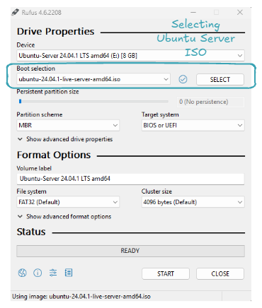
  <figcaption>Rufus Configuration</figcaption>
</figure>

Click on `START`, and now all you have to do is wait 👍. Congratulations, you've set up a bootable USB key! Let's use it to install Ubuntu Server on our machine!

## 🐧 Install Ubuntu Server OS

The goal now is to use the USB key containing our Ubuntu Server ISO to install Ubuntu Server on our machine.

<figure markdown="span">
  
  <figcaption>Install Ubuntu Server OS</figcaption>
</figure>

The ultimate goal is to have a machine that we can connect to via [SSH](https://www.techtarget.com/searchsecurity/definition/Secure-Shell), just like one rented from any [cloud provider](https://cloud.google.com/learn/what-is-a-cloud-service-provider) 😉.

Start by plugging the USB key, then turn ON the machine and open the [BIOS](https://en.wikipedia.org/wiki/BIOS). To open the BIOS, restart your PC and press the designated key (commonly F2, F12, Delete, or Esc), which depends on your PC's manufacturer.

<figure markdown="span">
  
  <figcaption>The USB key is set as the first boot option</figcaption>
</figure>

As explained on the screen, **the USB key is set as the first boot option**. Then restart the machine, you should be welcomed with the choice: `Try or install Ubuntu Server`.

<figure markdown="span">
  
  <figcaption>Try or install Ubuntu Server</figcaption>
</figure>

Select this choice, and then you will follow a series of instructions. Here are some tricky parts (obvious parts will not be detailed; regarding the few screens that will appear, I am not the original author. If you wish for a more detailed explanation, please check out [SavvyNik's video](https://www.youtube.com/watch?v=zs2zdVPwZ7E&t=753s) 👍).

- Choose the basic installation.

<figure markdown="span">
  
  <figcaption>Choose the basic installation</figcaption>
</figure>

- Set up the internet connection via Ethernet or WiFi.

<figure markdown="span">
  
  <figcaption>Network connections</figcaption>
</figure>

On your side, you may have more interfaces. It can also be via WiFi 👍! The important thing is to have one set up because **internet will be needed** for **package downloads and updates**, and, of course, for the **SSH connection through the home network**.

- `Use an entire disk` and `Set up this disk as LVM group`.

<figure markdown="span">
  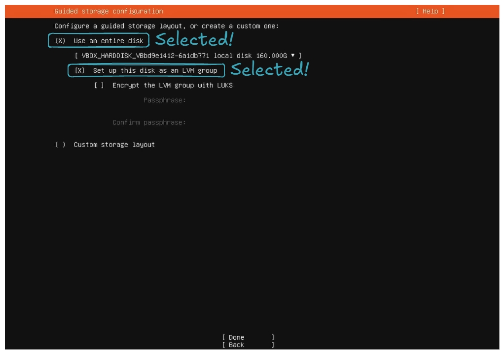
  <figcaption>Guided storage configuration</figcaption>
</figure>

- Set the storage configuration to utilize all the disk space.

For the storage configuration part, by default, it does not utilize all the disk space. You can see this in the `free space` field in the `DEVICE` section:

<figure markdown="span">
  
  <figcaption>Storage configuration - Before</figcaption>
</figure>

So the goal is to **allocate all this unconfigured free space to `ubuntu-lv`**. This will allow you to utilize all your disk space for your files, packages, etc.

<figure markdown="span">
  
  <figcaption>Storage configuration - Editing logical volumne ubuntu-lv of ubuntu-vg</figcaption>
</figure>

<figure markdown="span">
  
  <figcaption>Storage configuration - After</figcaption>
</figure>

- Install OpenSSH server.

<figure markdown="span">
  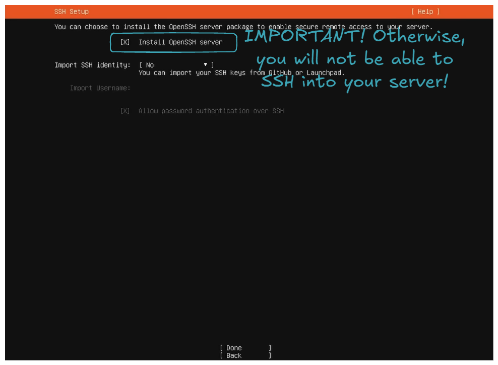
  <figcaption>Install OpenSSH server</figcaption>
</figure>

- Regarding `Featured Server Snaps`, do not select anything and select `Done`; it will start installing packages, be patient, and then just click `Reboot Now`.

<figure markdown="span">
  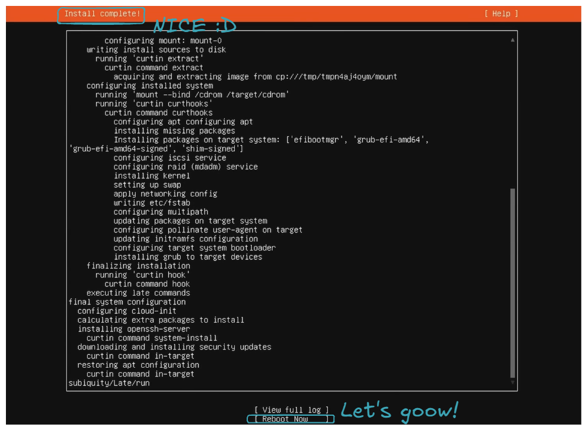
  <figcaption>Install complete!</figcaption>
</figure>

- You can now login!

Let it boot, and you should encounter an error because the USB key is still plugged in, and the server tries to boot from it. Turn off the server, **remove the USB key**, and then **boot up the server**. If you end up with the following screen, congratulations, you've **successfully installed Ubuntu Server 😍**!

<figure markdown="span">
  
  <figcaption>You can now login!</figcaption>
</figure>

Final thing, let's check if we can connect to the server from another machine via SSH. First, find the server's IP by logging in and running the following command on the server:

```bash title="From server"
ip a
```

It should give you a list of interfaces. Find the one that has an `inet` address formatted as `192.168.1.X`:

```bash title="From server"
...
4: wlp4s0: <BROADCAST,MULTICAST,UP,LOWER_UP> mtu 1500 qdisc noqueue state UP group default qlen 1000
    link/ether xx:xx:xx:xx:xx:xx brd ff:ff:ff:ff:ff:ff
    inet 192.168.1.X/24 metric 600 brd 192.168.1.255 scope global dynamic wlp4s0
       valid_lft 38554sec preferred_lft 38554sec
    inet6 xxxx:xxxx:xxxx:xxxx:xxxx:xxxx:xxxx:xxxx/64 scope global dynamic mngtmpaddr noprefixroute
       valid_lft 86165sec preferred_lft 86165sec
    inet6 fe80::xxxx:xxxx:xxxx:xxxx/64 scope link
       valid_lft forever preferred_lft forever
...
```

Let's connect via SSH.

```bash title="From work machine"
ssh myuser@192.168.1.X
```

If it connects:

```bash title="From work machine"
...
Last login: Mon Jan 13 05:49:37 2025 from 192.168.1.Y
myuser@myserver:~$
```

Then, congratulations! You've successfully set up a server similar to the ones you can rent from AWS or any other cloud provider 🤩. All the following commands will be executed from the work machine on behalf of the server via SSH from now on!

## 🐋 Set Up Docker, Portainer, and Nginx Proxy Manager

Now, it's time to set up all the necessary tools to deploy, maintain, and expose our services/applications: Docker, Portainer, and Nginx Proxy Manager.

<figure markdown="span">
  
  <figcaption>Docker, Portainer, and Nginx Proxy Manager</figcaption>
</figure>

Let's first install Docker ([official link](https://docs.docker.com/engine/install/ubuntu/#installation-methods), if necessary):

```bash
# Add Docker's official GPG key
sudo apt-get update
sudo apt-get install ca-certificates curl
sudo install -m 0755 -d /etc/apt/keyrings
sudo curl -fsSL https://download.docker.com/linux/ubuntu/gpg -o /etc/apt/keyrings/docker.asc
sudo chmod a+r /etc/apt/keyrings/docker.asc

# Add the repository to Apt sources
echo \
  "deb [arch=$(dpkg --print-architecture) signed-by=/etc/apt/keyrings/docker.asc] https://download.docker.com/linux/ubuntu \
  $(. /etc/os-release && echo "$VERSION_CODENAME") stable" | \
  sudo tee /etc/apt/sources.list.d/docker.list > /dev/null
sudo apt-get update
```

```bash
# Install Docker
sudo apt-get install docker-ce docker-ce-cli containerd.io docker-buildx-plugin docker-compose-plugin
```

You can verify the Docker installation using the following command:

```bash
sudo docker version
docker compose version
```

```bash
Client: Docker Engine - Community
 Version:           27.4.1
 API version:       1.47
 Go version:        go1.22.10
 Git commit:        b9d17ea
 Built:             Tue Dec 17 15:45:46 2024
 OS/Arch:           linux/amd64
 Context:           default

Server: Docker Engine - Community
 Engine:
  Version:          27.4.1
  API version:      1.47 (minimum version 1.24)
  Go version:       go1.22.10
  Git commit:       c710b88
  Built:            Tue Dec 17 15:45:46 2024
  OS/Arch:          linux/amd64
  Experimental:     false
 containerd:
  Version:          1.7.24
  GitCommit:        88bf19b2105c8b17560993bee28a01ddc2f97182
 runc:
  Version:          1.2.2
  GitCommit:        v1.2.2-0-g7cb3632
 docker-init:
  Version:          0.19.0
  GitCommit:        de40ad0
Docker Compose version v2.32.1
```

Then install Portainer ([official link](https://docs.portainer.io/start/install-ce/server/docker/linux#deployment), if necessary):

```bash
# Create Portainer volume
sudo docker volume create portainer_data

# Pull & Run Portainer
sudo docker run -d -p 8000:8000 -p 9443:9443 --name portainer --restart=always -v /var/run/docker.sock:/var/run/docker.sock -v portainer_data:/data portainer/portainer-ce:2.25.1
```

Once completed, you can **navigate to https://192.168.1.X:9443**. You should be prompted to **create the administrator account**. Once completed and logged in, the following screen should be presented to you:

<figure markdown="span">
  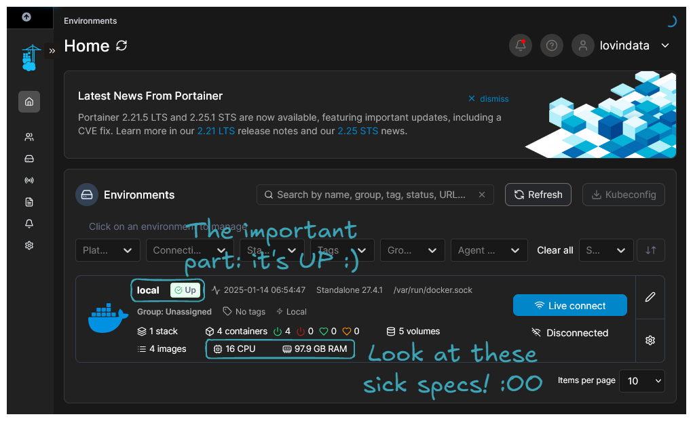
  <figcaption>Portainer ready!</figcaption>
</figure>

Congratulations, you've successfully installed Portainer! You can now deploy, maintain, and monitor containerized applications through a Web UI.

Finally, let's install Nginx Proxy Manager ([official link](https://nginxproxymanager.com/guide/#quick-setup), if necessary):

```bash
# Create Nginx Proxy Manager volumes
sudo docker volume create nginx_proxy_manager_data
sudo docker volume create nginx_proxy_manager_etc_letsencrypt

# Pull & Run Nginx Proxy Manager
sudo docker run -d -p 80:80 -p 443:443 -p 81:81 --name nginx_proxy_manager --restart=always -v nginx_proxy_manager_data:/data -v nginx_proxy_manager_etc_letsencrypt:/etc/letsencrypt jc21/nginx-proxy-manager:2.12.2
```

Once completed, you can **navigate to http://192.168.1.X:81**. The login and password are `admin@example.com` and `changeme`. Once logged in, you will be prompted to change these parameters and will be welcomed with the following screen:

<figure markdown="span">
  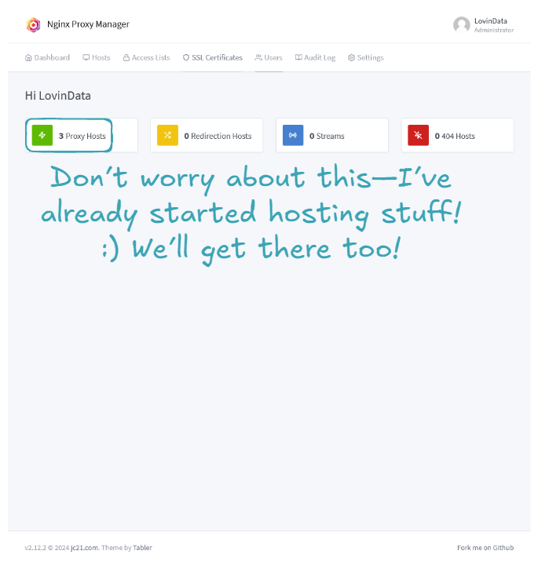
  <figcaption>Nginx Proxy Manager ready!</figcaption>
</figure>

Congratulation! you've successfully installed Nginx Proxy Manager! 🤗

## 🌐 Expose Your Services to the Internet Securely

In this section, we are going to expose Nginx Proxy Manager and Portainer to the outside world. The goal is to be able to manage, deploy, and maintain our services from anywhere! In this part, depending on your ISP and domain name provider, it's highly likely that you do not have exactly the same screens.

<figure markdown="span">
  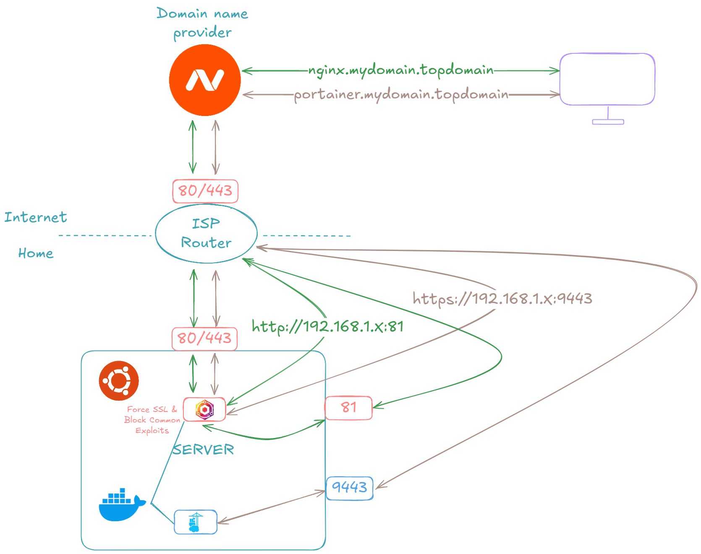
  <figcaption>Exposing Nginx Proxy Manager and Portainer to the outside world</figcaption>
</figure>

!!! warning

    Beware, exposing Nginx Proxy Manager and Portainer allows people to attempt to **crack your login/password**. If they succeed, it means they have **control over the deployed applications**. So, if working from home is the only thing you do, it might be wise not to expose these two services and to only access them from your home network!

Let's start by **forwarding ports 80 and 443 requests from our ISP router to our server's ports 80 and 443**:

<figure markdown="span">
  
  <figcaption>Forwarding ports 80 and 443 requests</figcaption>
</figure>

Let's now **get the CNAME or router's Internet IP**:

<figure markdown="span">
  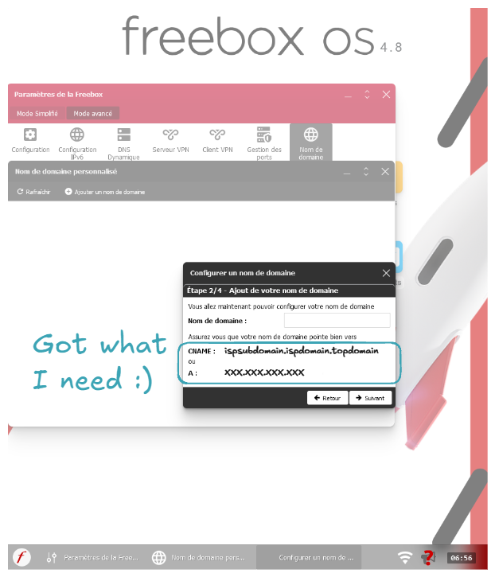
  <figcaption>Forwarding ports 80 and 443 requests</figcaption>
</figure>

!!! note

    You can also go to sites like [whatismyip.com](https://www.whatismyip.com/) to get your IP.

Now let's **buy a domain name**. In my case I choosed [namecheap.com](https://www.namecheap.com). After buying the domain name, let's **configure it to be routed to our ISP router**.

<figure markdown="span">
  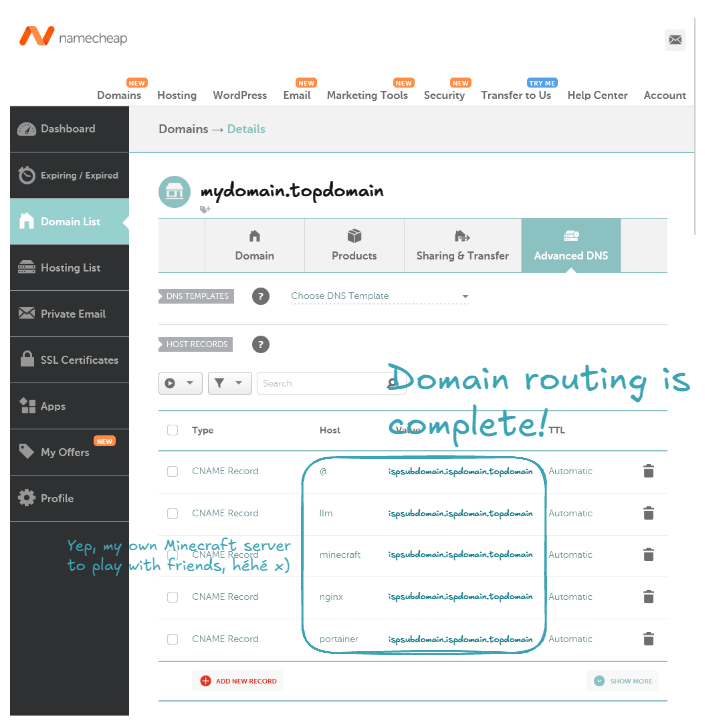
  <figcaption>Domain routing</figcaption>
</figure>

!!! Note

    You can also route to your ISP router using the IP address instead of the CNAME.

!!! Note

    Host means the subdomain name. For example, with a host of `nginx`, it will route the domain `nginx.mydomain.topdomain` to your ISP router.

Let's go back to our home network and **configure Nginx to allow requests from these domains to our services**. We will use the example of Nginx Proxy Manager itself:

<figure markdown="span">
  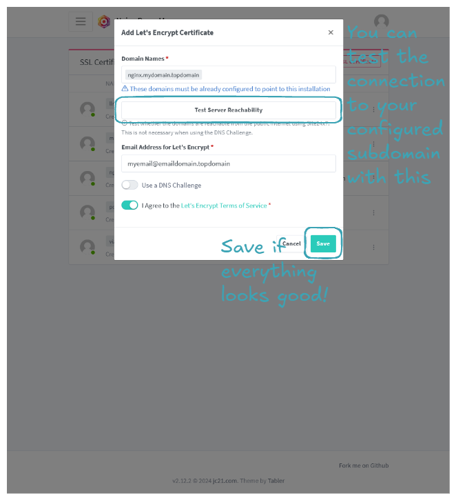
  <figcaption>Configure your "Let's Encrypt" SSL certificate for your domain</figcaption>
</figure>

<figure markdown="span">
  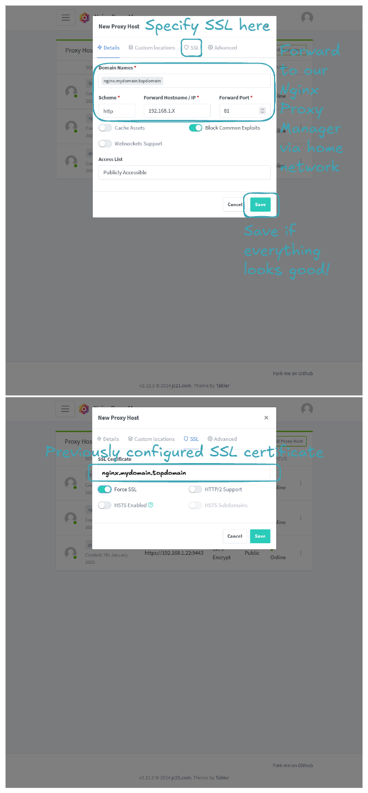
  <figcaption>"Add Proxy Host" to the corresponding service with "Force SSL" and the corresponding SSL certificate</figcaption>
</figure>

The **same steps can be applied to Portainer**, but be sure to use `https` as the `Scheme` when adding the proxy host, because the Portainer service uses https by default.

**Going to "nginx.mydomain.topdomain" and "portainer.mydomain.topdomain", you should be able to access** your two services! Congratulations, you've learned how to expose your services to the Internet! 🎉

## 🎯 Example Use Case: Open WebUI and Ollama Setup

This section aims to demonstrate how to properly install a stack of containers for a given application and expose it to the Internet. [LLMs](https://en.wikipedia.org/wiki/Large_language_model) are hot topics nowadays, so let's use the [Open WebUI](https://openwebui.com/) and [Ollama](https://ollama.com/) stack as an example.

<figure markdown="span">
  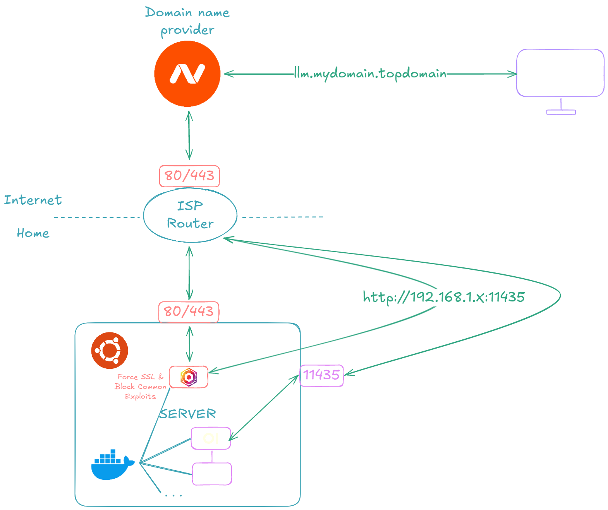
  <figcaption>Open WebUI and Ollama Setup</figcaption>
</figure>

Let's start by running the LLM container stack on our server. Here are the steps:

- Navigate to the Portainer home page.
- Select the `Local` environment, go to `Stacks`, and click on `Add stack`.
- Input a `Name` for the stack, for example, `llm`.
- Select `Web editor` and paste the following Docker Compose file.

```yaml
services:
  # https://github.com/open-webui/open-webui
  openwebui:
    image: ghcr.io/open-webui/open-webui:v0.5.4
    restart: unless-stopped
    ports:
      - ${OPENWEBUI_PORT}:8080
    environment:
      OLLAMA_API_BASE_URL: http://ollama:${OLLAMA_PORT}
    volumes:
      - openwebui_app_backend_data:/app/backend/data
    healthcheck:
      test: "curl -f http://localhost:8080"
      interval: 10s
      timeout: 5s
      retries: 5
    depends_on:
      ollama:
        condition: service_healthy

  # https://hub.docker.com/r/ollama/ollama/tags
  ollama:
    image: ollama/ollama:0.5.4
    restart: unless-stopped
    ports:
      - ${OLLAMA_PORT}:11434
    volumes:
      - ollama_root_ollama:/root/.ollama
    healthcheck:
      test: "ollama --version && ollama ps || exit 1" # https://github.com/ollama/ollama/issues/1378#issuecomment-2436650823
      interval: 10s
      timeout: 5s
      retries: 5

volumes:
  openwebui_app_backend_data:
    driver: local
  ollama_root_ollama:
    driver: local
```

- In the `Environment variables` section, add the following environment variables: `OPENWEBUI_PORT -> 11435` and `OLLAMA_PORT -> 11434`.

You should end up with a configuration that looks like this:

<figure markdown="span">
  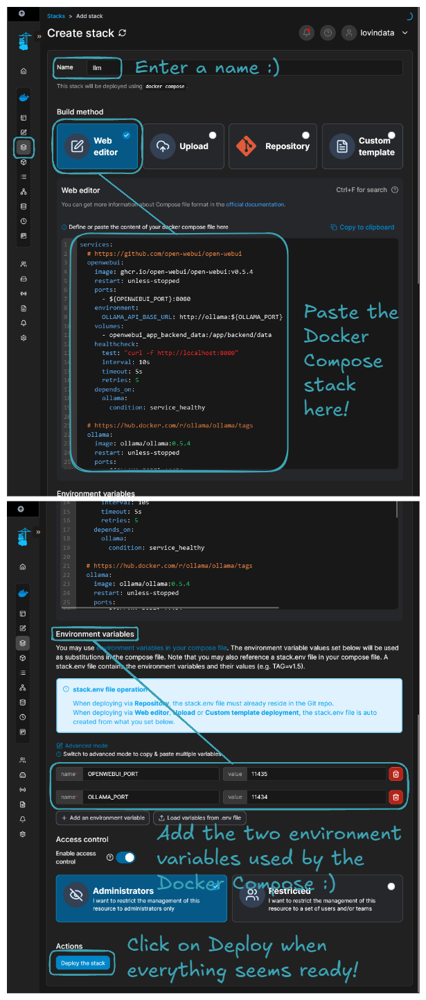
  <figcaption>Configuring the Open WebUI and Ollama stack</figcaption>
</figure>

Let's now expose our application to the outside world. To be precise, it means exposing the Open WebUI service. This part is identical to when Nginx Proxy Manager and Portainer were exposed, so I invite you to **check the [previous part](#-expose-your-services-to-the-internet-securely)**. The important part is to **expose only the Open WebUI and enable `Websockets Support`** because text writing on the fly is done through a websocket. After that, you should be able to **navigate to 'llm.mydomain.topdomain'**, and by **configuring your admin account (mandatory on first page load)**, you should end up on the following page:

<figure markdown="span">
  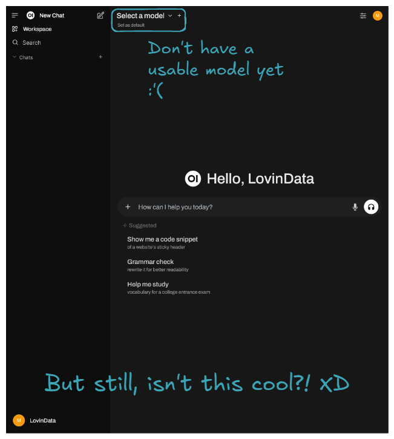
  <figcaption>Open WebUI</figcaption>
</figure>

Let's now download the latest [Phi-4](https://ollama.com/library/phi4) with its 14 billion parameters, rumored to rival [OpenAI's GPT-4o mini](https://openai.com/index/gpt-4o-mini-advancing-cost-efficient-intelligence/), which everyone is talking about. You can also try other LLMs instead; models are available in the [Ollama Models section](https://ollama.com/search).

<figure markdown="span">
  
  <figcaption>The Phi-4 model</figcaption>
</figure>

<figure markdown="span">
  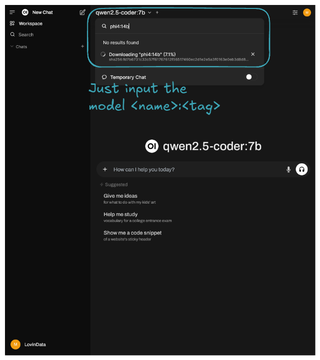
  <figcaption>Downloading the Phi-4 model</figcaption>
</figure>

Here is an example result of prompting:

<figure markdown="span">
  
  <figcaption>An example of a prompt result</figcaption>
</figure>

The latest Phi is running on our server, though it's currently best suited for background tasks due to its slower performance. 🎉 Congratulations! You've successfully self-hosted your own private LLM platform! 🚀

## 🔮 What's next?

My thoughts are that **self-hosting is ideal for ephemeral computation or data**. It's great because, as we can see, it’s more than doable, and when compared to cloud prices, it's less costly. However, running a full business on a self-hosted lab isn't ideal. My home isn’t "secure". So, if **user data is critical to the application, I would rent persistent services like [RDS](https://aws.amazon.com/rds/), [S3](https://aws.amazon.com/s3/), etc**. But for all the **application logic and computation, since it's ephemeral**, I would go the **self-hosting route**.

Regarding the technical/hardware side, I might buy another mini PC to set up a [K8S](https://kubernetes.io/) cluster. Alternatively, I’m considering the new [Intel Arc Battlemage GPUs](https://www.intel.com/content/www/us/en/newsroom/news/intel-launches-arc-b-series-graphics-cards.html) that just got released. The [GMKTec AMD Ryzen 7 8845HS Mini PC—NucBox K8 Plus](https://www.gmktec.com/collections/amd-mini-pc/products/amd-ryzen-7-8845hs-mini-pc-nucbox-k8-plus?spm=..collection_48a90fc4-e985-456a-b599-fb6d33eaa7be.collection_1.3&spm_prev=..index.header_1.1) I have even has an [Oculink](https://www.delock.com/infothek/OCuLink/oculink_e.html) port, héhé! Or maybe I’ll go for both options—imagine a [K8S cluster with GPU enabled](https://kubernetes.io/docs/tasks/manage-gpus/scheduling-gpus/) on each node 🤤. We’ll see!

I try to write monthly on the [LovinData Blog](https://lovindata.github.io/blog/) and on [Medium](https://medium.com/@jamesjg), and like to give back the knowledge I've learned. So don't hesitate to reach out; I'm always available to chat about nerdy stuff 🤗! Here are my socials: [LinkedIn](https://www.linkedin.com/in/james-jiang-87306b155/), [Twitter](https://twitter.com/jamesjg_) and [Reddit](https://www.reddit.com/user/lovindata/). Otherwise, let's learn together in the next story 🫡! Bye ❤️.
